<!--
================================================================================
  ReadyToGo — Rapport de projet
  Module : Gestion de projets — Année universitaire 2025-2026
  Ville : Tanger, Maroc
  Charte graphique : Orange (#F57C00) · Bleu détroit (#0B5394) · Blanc · Gris clair
  Ce document est rédigé en français académique. Les diagrammes utilisent la
  syntaxe Mermaid (rendue nativement sur GitHub et la plupart des visionneuses
  Markdown). Il peut être exporté en Word ou PDF sans perte de structure.
================================================================================
-->

# ReadyToGo
## Service de trottinettes électriques en libre-service à Tanger
### Rapport de projet — Module « Gestion de projets »

**Mobilité urbaine & Coupe du Monde 2030**

---

## Page de garde

| | |
|---|---|
| **Nom du projet** | ReadyToGo |
| **Module** | Gestion de projets |
| **Ville** | Tanger, Maroc |
| **Établissement** | *[À compléter]* |
| **Filière** | *[À compléter]* |
| **Enseignant** | *[À compléter]* |
| **Année universitaire** | 2025-2026 |
| **Date de remise** | *[À compléter]* |

**Équipe projet (5 membres) :**

| Rôle | Membre |
|---|---|
| Membre 1 — Chef de projet & coordination | *[Nom et prénom à compléter]* |
| Membre 2 — Responsable technique & application | *[Nom et prénom à compléter]* |
| Membre 3 — Responsable opérations, flotte & logistique | *[Nom et prénom à compléter]* |
| Membre 4 — Responsable finances, achats & risques | *[Nom et prénom à compléter]* |
| Membre 5 — Responsable communication & parties prenantes | *[Nom et prénom à compléter]* |

> **En-tête recommandé pour l'export Word/PDF :** « ReadyToGo — Rapport de projet » · pieds de page avec numérotation. Charte : orange, bleu détroit, blanc, gris clair.

---

## Remerciements

Nous adressons nos remerciements à notre enseignant du module « Gestion de projets » pour son encadrement méthodologique, ainsi qu'à l'ensemble des personnes qui ont accepté d'échanger avec nous sur les enjeux de mobilité urbaine à Tanger. Nous remercions également notre établissement pour la mise à disposition des ressources documentaires ayant permis de mener à bien ce travail collectif.

> *Section facultative — à personnaliser par l'équipe.*

---

## Résumé exécutif

**ReadyToGo** est un projet de micromobilité visant à déployer à Tanger un service de trottinettes électriques en libre-service. Il répond à un besoin concret : la congestion du centre-ville, la difficulté d'accès rapide à certaines zones stratégiques et l'afflux attendu de visiteurs à l'horizon de la **Coupe du Monde 2030**. ReadyToGo se positionne comme une **solution complémentaire** aux transports existants (bus, taxi, voiture, marche) pour les trajets courts, et non comme un substitut aux transports publics.

Le présent rapport traite le projet sous l'angle de la **gestion de projet**, conformément aux sept étapes attendues : définition, planification, organisation du travail, gestion des risques, plan de communication, suivi & indicateurs, et livraison. Il mobilise les outils standards de la discipline : arbre à problèmes et à objectifs, SWOT, PESTEL, objectifs SMART, WBS, diagramme de Gantt, matrice RACI, plan de charge, registre des risques, matrice probabilité-impact, KPI et **simulation de la valeur acquise (EVM)**.

Le déploiement est **progressif et jalonné** : phase pilote 2026-2027 (150 trottinettes, 12 bornes sur la corniche et le centre-ville), extension en 2028 (gare, aéroport, quartiers hôteliers), liaison vers le Grand Stade en 2029, puis dispositif renforcé pour 2030.

Sur le plan économique, l'analyse budgétaire détaillée (bottom-up) produit trois scénarios : **minimal ≈ 1,68 M DH**, **probable ≈ 2,16 M DH**, **maximal ≈ 2,76 M DH**. Le scénario probable dépasse légèrement (~8 %) la fourchette initiale de 1,5 à 2 M DH : cet écart est analysé et des leviers d'ajustement sont proposés. L'analyse du seuil de rentabilité situe le point mort opérationnel autour de **3,1 trajets par trottinette et par jour** ; le scénario de fréquentation « faible » est déficitaire, tandis que les scénarios « probable » et « élevé » dégagent une marge. Aucune rentabilité n'est promise : elle est **conditionnée** à l'adoption réelle du service.

Fait distinctif de ce rapport, une **simulation pédagogique des difficultés** est intégrée : dix problèmes réalistes (retard d'autorisation, hausse du prix des trottinettes, retard de l'application, surcharge d'un membre, pannes en test, stationnement non conforme, incident de cybersécurité, adoption faible, accident mineur, demande de changement de périmètre) surviennent effectivement dans le scénario et **modifient réellement** le planning, le budget, le plan de charge, les KPI et la courbe EVM (périodes avec SPI < 1 et CPI < 1), avant redressement grâce aux actions correctives.

**Conclusion :** ReadyToGo est **faisable sous conditions** (obtention des autorisations, maîtrise des coûts, adoption suffisante, qualité et sécurité). La réussite d'un projet ne réside pas dans l'absence de problèmes, mais dans la capacité de l'équipe à les détecter, décider et corriger rapidement.

---

## Liste des sigles et abréviations

| Sigle | Signification |
|---|---|
| **AC** | *Actual Cost* — Coût réel (EVM) |
| **BAC** | *Budget At Completion* — Budget à l'achèvement |
| **BRT** | *Bus Rapid Transit* — Bus à haut niveau de service |
| **CAPEX** | *Capital Expenditure* — Dépenses d'investissement |
| **CPI** | *Cost Performance Index* — Indice de performance des coûts |
| **CV** | *Cost Variance* — Écart de coût (EVM) |
| **DH** | Dirham marocain |
| **EAC** | *Estimate At Completion* — Coût final estimé |
| **ETC** | *Estimate To Complete* — Coût restant estimé |
| **EV** | *Earned Value* — Valeur acquise (EVM) |
| **EVM** | *Earned Value Management* — Gestion par la valeur acquise |
| **FRMF** | Fédération Royale Marocaine de Football |
| **GPS** | *Global Positioning System* — Géolocalisation |
| **IoT** | *Internet of Things* — Objets connectés |
| **KPI** | *Key Performance Indicator* — Indicateur clé de performance |
| **MVP** | *Minimum Viable Product* — Produit minimum viable |
| **OPEX** | *Operational Expenditure* — Dépenses de fonctionnement |
| **PESTEL** | Politique, Économique, Social, Technologique, Environnemental, Légal |
| **PMB** | *Performance Measurement Baseline* — Référentiel de mesure |
| **PV** | *Planned Value* — Valeur planifiée (EVM) |
| **PV (doc.)** | Procès-verbal (contexte livraison/recette) |
| **QR** | *Quick Response* (code) |
| **RACI** | Réalise, Approuve, Consulté, Informé |
| **RC** | Responsabilité Civile (assurance) |
| **RETEX** | Retour d'expérience |
| **SLA** | *Service Level Agreement* — Niveau de service contractuel |
| **SMART** | Spécifique, Mesurable, Atteignable, Réaliste, Temporellement défini |
| **SPI** | *Schedule Performance Index* — Indice de performance des délais |
| **SV** | *Schedule Variance* — Écart de délai (EVM) |
| **SWOT** | Forces, Faiblesses, Opportunités, Menaces |
| **VAC** | *Variance At Completion* — Écart final estimé |
| **WBS** | *Work Breakdown Structure* — Structure de découpage du projet |

> **Note terminologique :** dans ce rapport, « PV » désigne la *valeur planifiée* dans les sections EVM, et « procès-verbal » dans la section Livraison. Le contexte lève l'ambiguïté.

---

## Sommaire détaillé

1. **Introduction générale**
2. **Définition du projet**
   - 2.1 Présentation de ReadyToGo (concept, problème, solution, valeur, utilisateurs, zones, positionnement)
   - 2.2 Diagnostic (besoin, arbre à problèmes, arbre des objectifs, SWOT, PESTEL, justification)
   - 2.3 Objectifs SMART (général + spécifiques + tableau d'indicateurs)
   - 2.4 Périmètre (inclus, exclus, contraintes, hypothèses, dépendances, critères)
   - 2.5 Livrables attendus (tableau)
   - 2.6 Parties prenantes (registre, matrice pouvoir/intérêt, stratégie)
   - 2.7 Gouvernance
3. **Planification globale**
   - 3.1 Méthode de gestion (hybride)
   - 3.2 WBS
   - 3.3 Planning détaillé
   - 3.4 Diagrammes de Gantt (global 2026-2030 + pilote) & chemin critique
   - 3.5 Jalons
4. **Organisation du travail (5 personnes)**
   - 4.1 Rôles des membres
   - 4.2 Règles de répartition
   - 4.3 Tableau de répartition
   - 4.4 Répartition de la rédaction
   - 4.5 Matrice RACI
   - 4.6 Plan de charge
   - 4.7 Contribution individuelle
5. **Gestion des risques**
   - 5.1 Méthode · 5.2 Registre · 5.3 Matrice probabilité-impact · 5.4 Plans de réponse
6. **Plan de communication**
   - 6.1 Objectifs · 6.2 Canaux, messages & supports · 6.3 Matrice de communication · 6.4 Communication de crise
7. **Simulation des problèmes rencontrés** (journal des problèmes + 10 problèmes + cohérence)
8. **Suivi et indicateurs**
   - 8.1 KPI · 8.2 Simulation EVM · 8.3 Burndown · 8.4 Gestion des changements
9. **Livraison du projet**
   - 9.1 Vérification des livrables · 9.2 Validation · 9.3 Transfert · 9.4 RETEX simulés
10. **Analyse économique**
    - 10.1 Budget détaillé (3 scénarios) · 10.2 Tarification & revenus · 10.3 Seuil de rentabilité
11. **Qualité, sécurité et durabilité**
12. **Identité de ReadyToGo**
13. **Recommandations**
14. **Conclusion générale**
15. **Bibliographie**
16. **Annexes**
17. **Contrôle final**

> **Convention de lecture des encadrés :**
> - 🟠 **Hypothèse de travail à valider** : donnée non vérifiée, à confirmer.
> - 🔵 **Décision** : choix structurant de l'équipe.
> - 🔴 **Risque / alerte** : point de vigilance.
> - ✅ **Donnée de référence** : valeur utilisée de façon cohérente dans tout le rapport.

---

# 1. Introduction générale

Tanger connaît une croissance urbaine et touristique soutenue. La ville accueillera des matchs de la **Coupe du Monde 2030**, ce qui accentuera la pression sur ses réseaux de déplacement. Or, le centre-ville souffre déjà d'une congestion récurrente, les temps de trajet vers les zones stratégiques (notamment le Grand Stade) sont élevés, et l'offre de taxis peut se révéler insuffisante aux heures de pointe. Dans ce contexte, la **micromobilité** — et en particulier la trottinette électrique en libre-service — constitue une réponse pertinente pour les **trajets courts**, en complément du bus, du taxi, de la voiture et de la marche.

**ReadyToGo** est le projet porté par notre équipe de cinq personnes pour répondre à ce besoin. Il ne s'agit pas seulement de présenter une idée commerciale : ce rapport a pour objet de **démontrer la maîtrise de la démarche de gestion de projet**, depuis la définition du besoin jusqu'à la livraison, en passant par la planification, l'organisation de l'équipe, la gestion des risques, la communication et le pilotage par indicateurs.

**Problématique :** *dans quelle mesure un service de trottinettes électriques en libre-service peut-il être planifié, organisé et piloté à Tanger pour améliorer la mobilité sur les trajets courts, de manière économiquement soutenable et suffisamment robuste pour absorber les aléas d'un projet réel, à l'horizon 2030 ?*

Pour y répondre, le rapport adopte le plan suivant : après la **définition** du projet (concept, diagnostic, objectifs SMART, périmètre, livrables, parties prenantes, gouvernance), il présente la **planification** (méthode hybride, WBS, planning, Gantt, jalons), l'**organisation** de l'équipe (rôles, RACI, plan de charge), la **gestion des risques**, le **plan de communication**, puis une **simulation réaliste des problèmes rencontrés**, le **suivi par indicateurs** (KPI et EVM), la **livraison**, l'**analyse économique**, et enfin les dimensions **qualité, sécurité, durabilité** avant les recommandations et la conclusion.

Deux partis pris méthodologiques structurent l'ensemble : (i) une **distinction systématique** entre données vérifiées, estimations et hypothèses de travail ; (ii) une **honnêteté de simulation** — le projet n'est pas présenté comme parfait, mais comme un projet réel confronté à des difficultés que l'équipe détecte, décide et corrige.

> 🔵 **Décision — Périmètre du rapport :** ReadyToGo est traité principalement comme un **objet de gestion de projet**. Les éléments commerciaux (tarifs, revenus) sont mobilisés uniquement pour étayer l'analyse de faisabilité économique.

---

# 2. Définition du projet *(Étape 1)*

## 2.1 Présentation de ReadyToGo

**Concept.** ReadyToGo est un service de **trottinettes électriques partagées** accessibles via une application mobile. L'utilisateur localise, déverrouille et paie son trajet depuis son smartphone, puis stationne la trottinette dans une **zone autorisée**. Une équipe locale assure la recharge, la redistribution, la maintenance et l'assistance.

**Problème.** Les déplacements courts en centre-ville de Tanger sont pénalisés par la congestion, l'irrégularité de l'offre de taxis aux heures de pointe et l'absence d'une solution rapide, flexible et abordable pour le « dernier kilomètre » entre la corniche, le centre-ville, la gare, les quartiers hôteliers et, à terme, les pôles de transport et le Grand Stade.

**Solution.** Un réseau de trottinettes et de bornes de stationnement/recharge, piloté par une plateforme numérique (GPS, verrouillage électronique, paiement intégré, géofencing), déployé de manière progressive et jalonnée jusqu'en 2030.

**Proposition de valeur.**
- **Pour l'usager :** gagner du temps sur les trajets courts, à un prix intermédiaire entre le bus et le taxi, avec une disponibilité 7j/7.
- **Pour la ville :** une offre de mobilité douce complémentaire, susceptible de réduire une partie des trajets courts en voiture/taxi, utile pour l'image de Tanger à l'horizon 2030.
- **Pour les partenaires (hôtels, événements) :** un service à valeur ajoutée pour leurs clients et une surface de visibilité.

**Utilisateurs ciblés.** Habitants effectuant des trajets domicile-travail ou utilitaires courts ; étudiants ; touristes et visiteurs (notamment 2030) ; clientèle hôtelière.

**Zones concernées.** Corniche et centre-ville (pilote) ; puis gare Tanger-Ville, aéroport Ibn Battouta, quartiers hôteliers (extension) ; puis liaison vers le Grand Stade et pôles de transport (BRT).

**Positionnement.** Le tableau ci-dessous situe ReadyToGo par rapport aux alternatives.

| Mode | Vitesse trajet court | Coût indicatif (trajet court) | Flexibilité | Rôle vis-à-vis de ReadyToGo |
|---|---|---|---|---|
| Marche | Faible | Gratuit | Élevée | Complémentaire (très courtes distances) |
| Bus / BRT | Moyenne | ≈ 4-6 DH | Faible (lignes fixes) | Complémentaire (moyenne/longue distance) |
| Petit taxi | Moyenne à élevée | ≈ 10-25 DH | Moyenne | Concurrent partiel / complémentaire |
| Voiture personnelle | Faible en congestion | Élevé (essence, stationnement) | Moyenne | Substituable sur trajets courts |
| **ReadyToGo** | **Élevée** | **≈ 13 DH (10 min)** | **Élevée** | **Solution de micromobilité pour trajets courts** |

> *Interprétation :* ReadyToGo se place entre le bus (moins cher mais plus lent) et le taxi (plus rapide mais plus cher), en apportant une flexibilité supérieure sur les trajets courts. Il ne remplace pas les transports publics : il les **complète**.

> 🟠 **Hypothèse de travail à valider :** les coûts des modes concurrents sont des ordres de grandeur du marché tangérois, à confirmer par relevé terrain.

## 2.2 Diagnostic

### 2.2.1 Analyse du besoin

Le besoin est double : (i) un besoin **quotidien** des habitants et étudiants pour des trajets courts rapides et abordables ; (ii) un besoin **événementiel** lié à l'afflux de visiteurs en 2030. Le service doit donc être **dimensionnable** (montée en charge progressive) et **fiable** (disponibilité, sécurité, stationnement ordonné) pour être accepté par la ville et les habitants.

### 2.2.2 Arbre à problèmes

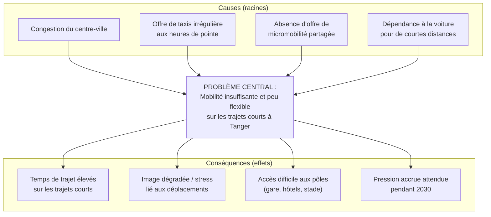

> *Interprétation :* le problème central provient surtout de l'**absence d'une offre de micromobilité partagée** et de la dépendance à la voiture/taxi pour des trajets courts. Agir sur ces causes réduit mécaniquement les conséquences.

### 2.2.3 Arbre des objectifs

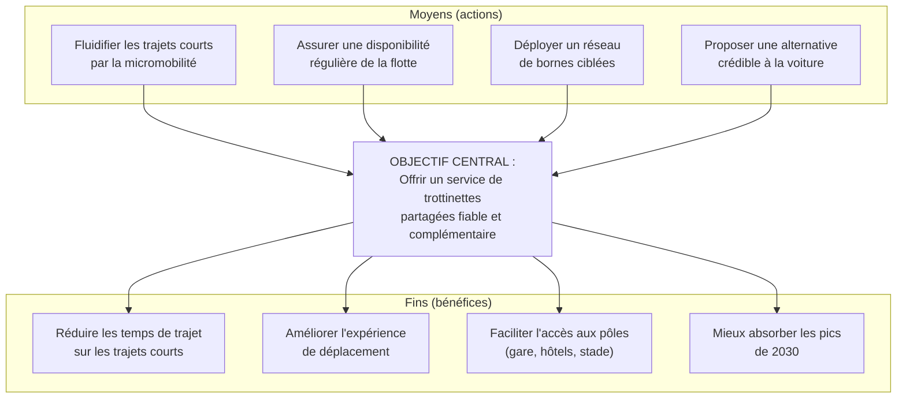

> *Interprétation :* l'arbre des objectifs est le miroir positif de l'arbre à problèmes ; il fonde les objectifs SMART de la section 2.3.

### 2.2.4 Analyse SWOT

| **Forces (interne +)** | **Faiblesses (interne −)** |
|---|---|
| Concept simple et éprouvé ailleurs | Investissement initial élevé (CAPEX) |
| Déploiement progressif et jalonné | Dépendance à des fournisseurs externes |
| Équipe pluridisciplinaire de 5 personnes | Absence d'historique d'exploitation local |
| Positionnement tarifaire intermédiaire clair | Modèle économique sensible à l'adoption |
| Plateforme numérique (GPS, géofencing, paiement) | Besoin d'autorisations préalables |

| **Opportunités (externe +)** | **Menaces (externe −)** |
|---|---|
| Coupe du Monde 2030 (demande, visibilité) | Réglementation défavorable ou tardive |
| Volonté de mobilité durable | Vol, vandalisme, accidents |
| Partenariats hôtels / événements envisageables | Concurrence / copie rapide du concept |
| Complémentarité avec BRT et pistes cyclables | Acceptabilité sociale (stationnement, trottoirs) |
| Marché touristique en croissance | Aléas d'approvisionnement et hausse des coûts |

> *Interprétation :* les forces et opportunités justifient le lancement ; les faiblesses et menaces (CAPEX, autorisations, adoption, sécurité) sont précisément les points que la **gestion des risques** (§5) et la **simulation des problèmes** (§7) traiteront.

### 2.2.5 Analyse PESTEL synthétique

| Facteur | Éléments clés pour ReadyToGo |
|---|---|
| **Politique** | Volonté d'améliorer la mobilité en vue de 2030 ; rôle de la mairie pour l'occupation de l'espace public. |
| **Économique** | Pouvoir d'achat, sensibilité au prix, coûts d'importation des équipements, fluctuation des composants. |
| **Social** | Culture de la marche/taxi, acceptabilité du stationnement, sécurité perçue, clientèle étudiante et touristique. |
| **Technologique** | Maturité des solutions IoT (GPS, verrouillage, paiement mobile), connectivité, géofencing. |
| **Environnemental** | Bénéfice potentiel si report modal de la voiture ; enjeux de recharge, durée de vie et recyclage des batteries. |
| **Légal** | Autorisations d'occupation du domaine public, assurances, protection des données personnelles, règles de circulation. |

> *Interprétation :* les facteurs **Politique/Légal** (autorisations) et **Social** (acceptabilité, stationnement) sont les plus déterminants à court terme ; ils orientent la stratégie d'engagement des parties prenantes (§2.6).

### 2.2.6 Justification de l'utilité du projet

ReadyToGo est utile s'il **réduit effectivement** le temps et le coût perçus des trajets courts pour une part significative d'usagers, tout en restant **acceptable** (stationnement ordonné, sécurité) et **soutenable** économiquement. Le rapport ne postule pas cette utilité : il la **conditionne** à des critères vérifiables (objectifs SMART, KPI, seuil de rentabilité) et l'éprouve via une simulation d'aléas.

## 2.3 Objectifs SMART

**Objectif général (SMART).** *Concevoir, autoriser et déployer d'ici le 1ᵉʳ octobre 2026 un service pilote ReadyToGo de 150 trottinettes et 12 bornes sur la corniche et le centre-ville de Tanger, avec une application fonctionnelle et une équipe locale opérationnelle, en respectant un budget de référence de 2,0 M DH (± 10 %) et une disponibilité de flotte ≥ 90 % sur les trois premiers mois d'exploitation.*

**Objectifs spécifiques (SMART) et indicateurs :**

| # | Objectif | Indicateur | Valeur cible | Échéance | Responsable | Moyen de vérification |
|---|---|---|---|---|---|---|
| OS1 | Déployer la flotte pilote | Nb de trottinettes en service | 150 | 30/09/2026 | Membre 3 | Inventaire flotte / back-office |
| OS2 | Installer les bornes | Nb de bornes opérationnelles | 12 | 31/07/2026 | Membre 3 | PV d'installation |
| OS3 | Livrer l'application | Version en production (paiement + GPS) | 1 (MVP) | 31/08/2026 | Membre 2 | Recette technique |
| OS4 | Assurer la disponibilité | Taux de disponibilité flotte | ≥ 90 % | 31/12/2026 | Membre 3 | Tableau de bord exploitation |
| OS5 | Satisfaire les utilisateurs | Note moyenne de satisfaction | ≥ 4/5 | 31/12/2026 | Membre 5 | Enquête in-app |
| OS6 | Maîtriser la réparation | Délai moyen de remise en service | ≤ 48 h | 31/12/2026 | Membre 3 | Journal maintenance |
| OS7 | Respecter le budget | Écart budgétaire (CPI) | CPI ≥ 0,95 | 31/12/2026 | Membre 4 | Suivi budgétaire / EVM |
| OS8 | Assurer un stationnement conforme | Taux de stationnement conforme | ≥ 85 % | 31/12/2026 | Membre 5 | Données géofencing |
| OS9 | Garantir la sécurité | Taux d'incidents / 1 000 trajets | ≤ 1,5 | 31/12/2026 | Membre 3 | Registre d'incidents |

> *Interprétation :* ces objectifs couvrent délai (OS1-OS3), performance opérationnelle (OS4, OS6, OS8), coût (OS7), et valeur d'usage/sécurité (OS5, OS9). Ils alimentent directement les KPI de suivi (§8.1). Les cibles sont des **hypothèses de travail à valider** lors du cadrage définitif.

## 2.4 Périmètre

| Dimension | Contenu |
|---|---|
| **Inclus** | Service pilote (corniche + centre-ville) ; 150 trottinettes ; 12 bornes ; application mobile (MVP : compte, localisation, scan/déverrouillage, paiement, fin de trajet) ; GPS + verrouillage + géofencing ; dispositif de maintenance/recharge/redistribution ; équipe locale ; tableau de bord ; documentation ; formation. |
| **Exclus** | Extension géographique (gare, aéroport, hôtels, stade) — phases 2 à 4 ; fabrication des trottinettes ; exploitation à grande échelle 2030 (préparée mais hors périmètre pilote) ; services annexes (assurance client optionnelle, casques connectés). |
| **Contraintes** | Obtention préalable des autorisations ; budget de référence 2,0 M DH (± 10 %) ; échéance de lancement pilote ; conformité protection des données ; disponibilité des 5 membres (étudiants). |
| **Hypothèses** | Autorisations obtenues dans les délais négociés ; fournisseurs livrant conformément ; adoption suffisante ; stabilité relative des prix (*hypothèses de travail à valider*). |
| **Dépendances** | Autorisation municipale → installation des bornes ; livraison trottinettes → tests ; application → tests utilisateurs ; formation → lancement. |
| **Critères de réussite** | Pilote lancé dans les délais et le budget ± 10 %, disponibilité ≥ 90 %, satisfaction ≥ 4/5, aucun incident grave. |
| **Critères d'acceptation** | Chaque livrable validé selon son critère (voir §2.5) et procès-verbal de recette signé (voir §9.2). |

> 🔵 **Décision — Gestion du périmètre :** toute demande hors périmètre suit le **processus de changement** (§8.4) ; par défaut, les demandes d'extension sont reportées en phase 2 (voir Problème 10, §7).

## 2.5 Livrables attendus

| Livrable | Description | Responsable | Échéance | Critère d'acceptation | Validateur |
|---|---|---|---|---|---|
| Charte du projet | Cadrage, objectifs, gouvernance | Membre 1 | 30/01/2026 | Approuvée par le sponsor | Sponsor |
| Étude de faisabilité | Analyse technique, économique, juridique | Membre 4 | 13/03/2026 | Recommandation argumentée | Comité de pilotage |
| Cahier des charges | Exigences techniques et fonctionnelles | Membre 2 | 24/04/2026 | Exigences tracées et validées | Membre 1 |
| Autorisations | Dossier d'occupation du domaine public | Membre 1 (support M5) | 29/05/2026 | Accord écrit obtenu | Autorité compétente |
| Application mobile (MVP) | iOS/Android + back-office | Membre 2 | 31/08/2026 | Parcours complet fonctionnel | Membre 1 |
| Système de paiement | Passerelle intégrée et sécurisée | Membre 2 | 31/08/2026 | Transaction test réussie | Membre 4 |
| GPS & verrouillage | Modules IoT sur flotte | Membre 2 (support M3) | 31/08/2026 | Localisation + verrouillage OK | Membre 3 |
| Flotte pilote | 150 trottinettes réceptionnées | Membre 3 | 17/07/2026 | Conformité au cahier des charges | Membre 4 |
| Bornes installées | 12 bornes opérationnelles | Membre 3 | 31/07/2026 | PV d'installation | Membre 1 |
| Dispositif de maintenance | Procédures, stock de pièces | Membre 3 | 17/07/2026 | Procédures testées | Membre 1 |
| Documentation | Manuels, procédures, FAQ | Membre 2 (support M3) | 25/09/2026 | Complète et à jour | Membre 1 |
| Formation du personnel | Équipe locale formée | Membre 3 (support M5) | 17/07/2026 | Évaluation réussie | Membre 1 |
| Plan de communication | Stratégie et supports | Membre 5 | 26/06/2026 | Validé par le comité | Membre 1 |
| Tableau de bord | KPI et suivi | Membre 4 | 25/09/2026 | KPI alimentés | Membre 1 |
| Rapport de test | Résultats tests technique/utilisateur | Membre 2 (support M5) | 25/09/2026 | Anomalies traitées | Comité de pilotage |
| Rapport final de livraison | Bilan et transfert | Membre 1 | 31/10/2026 | PV de recette signé | Sponsor |

> *Interprétation :* chaque livrable possède un **responsable unique**, une **échéance** et un **critère d'acceptation** vérifiable, ce qui permet le contrôle en phase de livraison (§9.1).

## 2.6 Parties prenantes

### 2.6.1 Registre des parties prenantes et stratégie d'engagement

| Partie prenante | Rôle | Attentes | Pouvoir | Intérêt | Position actuelle | Position souhaitée | Stratégie |
|---|---|---|---|---|---|---|---|
| Équipe projet (5 membres) | Réalisation | Réussite, apprentissage | Élevé | Élevé | Moteur | Moteur | Impliquer / responsabiliser |
| Chef de projet (Membre 1) | Pilotage | Coordination, respect des jalons | Élevé | Élevé | Moteur | Moteur | Leadership |
| Sponsor (envisagé) | Financement/appui | Retour, maîtrise des risques | Élevé | Élevé | Neutre | Soutien | Gérer de près |
| Mairie de Tanger | Autorisation espace public | Ordre public, image de la ville | Élevé | Moyen | Neutre | Soutien | Gérer de près (concertation) |
| Autorités compétentes | Réglementation, sécurité | Conformité | Élevé | Faible | Neutre | Favorable | Satisfaire / informer |
| Habitants | Usagers / riverains | Sécurité, stationnement ordonné | Moyen | Élevé | Neutre | Favorable | Tenir informés / consulter |
| Étudiants | Usagers | Prix, disponibilité | Faible | Élevé | Favorable | Ambassadeurs | Tenir informés / animer |
| Touristes | Usagers | Simplicité, multilingue | Faible | Moyen | Neutre | Favorable | Informer (2030) |
| Fournisseurs (trottinettes/bornes) | Approvisionnement | Volume, paiement | Moyen | Moyen | Neutre | Fiable | Contractualiser (SLA) |
| Développeurs (prestataire) | Application | Cahier des charges clair | Moyen | Moyen | Neutre | Fiable | Suivre de près |
| Opérateurs de paiement | Encaissement | Volume, conformité | Moyen | Moyen | Neutre | Fiable | Contractualiser |
| Équipes de maintenance | Exploitation | Conditions de travail | Faible | Élevé | Favorable | Engagées | Former / motiver |
| Hôtels | Partenaires (envisagés) | Service pour clients, commission | Moyen | Moyen | Neutre | Partenaires | Proposer partenariat |
| Partenaires transport (BRT, taxis) | Complémentarité | Non-cannibalisation | Moyen | Faible | Neutre | Neutre/favorable | Dialoguer |
| Services de secours | Sécurité | Procédures d'accident claires | Moyen | Faible | Neutre | Favorable | Informer / coordonner |
| Investisseurs & sponsors potentiels | Financement | Rentabilité, risque maîtrisé | Élevé | Moyen | Neutre | Soutien | Convaincre (dossier) |

### 2.6.2 Matrice pouvoir/intérêt

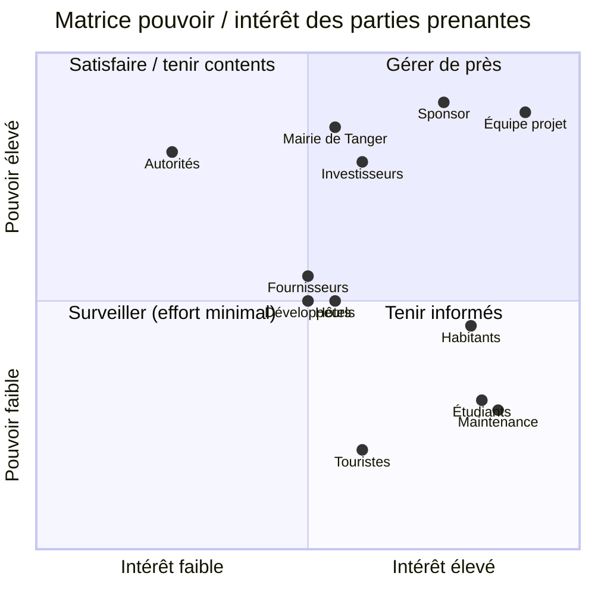

> *Interprétation :* la **mairie**, le **sponsor** et les **investisseurs** (pouvoir élevé) sont à « gérer de près » ; les **habitants** et **étudiants** (intérêt élevé, pouvoir moindre) sont à tenir informés et à mobiliser comme relais. Cette matrice fonde le plan de communication (§6).

## 2.7 Gouvernance

- **Sponsor (envisagé) :** porteur financier et institutionnel ; arbitre les décisions majeures (budget, périmètre). *Hypothèse de travail à valider.*
- **Chef de projet (Membre 1) :** pilote l'exécution, anime les réunions, suit les jalons, consolide le rapport.
- **Comité de pilotage :** sponsor + chef de projet + les 5 membres ; se réunit aux jalons et mensuellement.
- **Les cinq membres :** responsables de leurs lots (voir §4).
- **Partenaires externes :** fournisseurs, prestataire application, opérateur de paiement — toujours **supervisés par un membre**.

**Règles de décision.** Décisions opérationnelles : par le membre responsable. Décisions engageant coût/délai/périmètre : par le chef de projet, validées par le comité de pilotage. **Règle : une seule personne « Approuve » (A) par décision** (cohérent avec la RACI, §4.5).

**Règles d'escalade.** Tout écart dépassant le seuil d'alerte d'un KPI (§8.1) ou toute demande de changement à impact significatif est **escaladé** au chef de projet sous 48 h, puis au comité de pilotage si l'impact dépasse 5 % du budget ou 2 semaines de délai.

**Fréquence des réunions.** Point d'équipe hebdomadaire (30 min) ; comité de pilotage mensuel ; revue de jalon à chaque jalon.

**Circuit de validation.** Production (membre responsable) → relecture croisée (autre membre) → validation (chef de projet) → approbation (comité/sponsor pour les livrables majeurs).

---

# 3. Planification globale *(Étape 2)*

## 3.1 Méthode de gestion (hybride)

ReadyToGo combine des composantes très différentes : d'un côté des éléments **prévisibles et séquentiels** (autorisations administratives, achats, installation d'infrastructures), de l'autre un produit **évolutif et incertain** (l'application mobile et l'amélioration continue du service). Une seule méthode ne convient pas.

> 🔵 **Décision — Méthode hybride :**
> - **Approche prédictive (cycle en V / jalons)** pour les autorisations, les achats de trottinettes et de bornes, et l'installation. Ces lots supposent des séquences fixes, des engagements contractuels et des délais peu compressibles ; ils se pilotent par jalons et livrables figés.
> - **Approche agile (sprints de 2 semaines)** pour l'application mobile et l'optimisation du service. Ces lots comportent de l'incertitude fonctionnelle ; ils bénéficient d'itérations, d'un backlog priorisé et de démonstrations en fin de sprint (voir burndown, §8.3).

*Justification :* l'hybridation réduit le risque global. Elle permet d'avancer sur le logiciel (agile) **pendant** l'attente des autorisations (prédictif), ce qui est précisément exploité comme action corrective lors du Problème 1 (§7). Elle sépare aussi clairement ce qui doit être « bon du premier coup » (infrastructures) de ce qui peut « s'améliorer par itération » (application).

## 3.2 WBS (structure de découpage)

```mermaid
flowchart TB
    P["ReadyToGo — Projet pilote"]
    P --> L1["1. Cadrage"]
    P --> L2["2. Étude de faisabilité"]
    P --> L3["3. Autorisations"]
    P --> L4["4. Conception du service"]
    P --> L5["5. Sélection fournisseurs"]
    P --> L6["6. Achat trottinettes"]
    P --> L7["7. Installation bornes"]
    P --> L8["8. Développement application"]
    P --> L9["9. Intégration paiement & GPS"]
    P --> L10["10. Recrutement"]
    P --> L11["11. Formation"]
    P --> L12["12. Tests"]
    P --> L13["13. Lancement pilote"]
    P --> L14["14. Suivi & optimisation"]
    P --> L15["15. Extension"]
    P --> L16["16. Préparation 2030"]
    P --> L17["17. Livraison"]
    P --> L18["18. Clôture"]
    L8 --> L8a["8.1 MVP (compte, scan, trajet)"]
    L8 --> L8b["8.2 Back-office"]
    L9 --> L9a["9.1 Passerelle paiement"]
    L9 --> L9b["9.2 Modules GPS/IoT"]
    L12 --> L12a["12.1 Tests techniques"]
    L12 --> L12b["12.2 Tests sécurité"]
    L12 --> L12c["12.3 Tests utilisateurs"]
```

> *Interprétation :* la WBS décompose le projet en 18 lots. Les lots 6-7 (achats/installation) et 8-9 (logiciel) sont les plus consommateurs de ressources et concentrent les risques ; ils reçoivent une attention particulière dans le planning et l'EVM.

## 3.3 Planning détaillé

Le planning ci-dessous correspond au **cadrage de référence** de la phase pilote (avant matérialisation des problèmes ; les décalages simulés sont introduits en §7 et répercutés dans le Gantt « réel » §3.4 et l'EVM §8.2). Toutes les tâches sont attribuées à un membre ou à une ressource externe **supervisée** par un membre.

| ID | Tâche | Durée | Début | Fin | Préd. | Responsable | Livrable |
|---|---|---|---|---|---|---|---|
| T1 | Cadrage & charte | 4 sem | 05/01/2026 | 30/01/2026 | — | Membre 1 | Charte |
| T2 | Étude de faisabilité | 6 sem | 02/02/2026 | 13/03/2026 | T1 | Membre 4 | Étude |
| T3 | Demande d'autorisations | 8 sem | 16/03/2026 | 08/05/2026 | T2 | Membre 1 (S: M5) | Dossier autorisations |
| T4 | Conception service & cahier des charges | 6 sem | 16/03/2026 | 24/04/2026 | T2 | Membre 2 (S: M3) | Cahier des charges |
| T5 | Sélection fournisseurs | 4 sem | 27/04/2026 | 22/05/2026 | T4 | Membre 4 (S: M3) | Contrats fournisseurs |
| T6 | Achat & réception trottinettes | 8 sem | 25/05/2026 | 17/07/2026 | T5 | Membre 3 (S: M4) | Flotte pilote |
| T7 | Développement application (MVP) | 16 sem | 06/04/2026 | 24/07/2026 | T4 | Membre 2 | Application MVP |
| T8 | Intégration paiement & GPS | 6 sem | 15/06/2026 | 24/07/2026 | T7 | Membre 2 (S: M3) | Paiement + GPS |
| T9 | Installation bornes | 6 sem | 01/06/2026 | 10/07/2026 | T3, T5 | Membre 3 | 12 bornes |
| T10 | Recrutement équipe locale | 4 sem | 01/06/2026 | 26/06/2026 | T5 | Membre 5 (S: M1) | Équipe recrutée |
| T11 | Formation équipe locale | 3 sem | 29/06/2026 | 17/07/2026 | T10 | Membre 3 (S: M5) | Équipe formée |
| T12 | Tests techniques & sécurité | 5 sem | 27/07/2026 | 28/08/2026 | T6, T8 | Membre 2 | Rapport de test |
| T13 | Tests utilisateurs | 3 sem | 31/08/2026 | 18/09/2026 | T12 | Membre 5 | RETEX utilisateurs |
| T14 | Lancement pilote | 1 sem | 21/09/2026 | 25/09/2026 | T13, T11, T9 | Membre 1 | Mise en service |
| T15 | Suivi & optimisation | 26 sem | 01/10/2026 | 31/03/2027 | T14 | Tous | Tableau de bord |
| T16 | Livraison & recette | 3 sem | 12/10/2026 | 30/10/2026 | T14 | Membre 1 | PV de recette |
| T17 | Clôture pilote / bilan | 2 sem | 02/11/2026 | 13/11/2026 | T16 | Membre 1 | Rapport final |

> *Interprétation :* le **chemin critique** de référence passe par T1 → T2 → T3 → T5 → T6 → T12 → T13 → T14 (autorisations, fournisseurs, réception flotte, tests). Le développement application (T7-T8) est **en parallèle** mais devient critique s'il déborde — ce qui se produit dans la simulation (Problème 3, §7).

## 3.4 Diagrammes de Gantt & chemin critique

### 3.4.1 Gantt global 2026-2030 (macro-planning des phases)

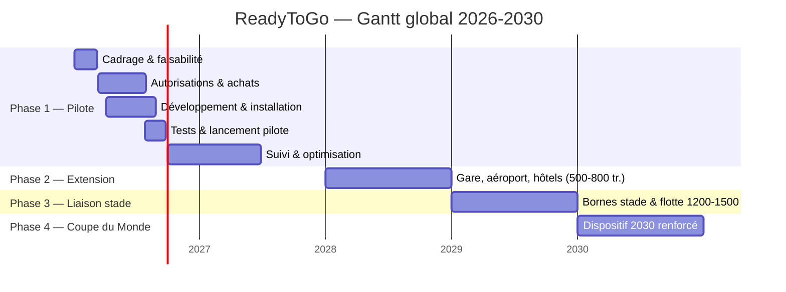

> *Interprétation :* la trajectoire est **incrémentale** : chaque phase capitalise sur la précédente. La décision de passage à la phase 2 dépend de l'évaluation du pilote (jalon J12, §3.5).

### 3.4.2 Gantt détaillé de la phase pilote — planning « réel » (avec aléas simulés)

Ce Gantt intègre les **décalages issus des problèmes** du §7 : retard d'autorisation (+3 sem, Pb1), retard application (+2 sem, Pb3), reprise de tests après pannes et incident cyber (Pb5, Pb7). Les jalons sont marqués par des losanges.

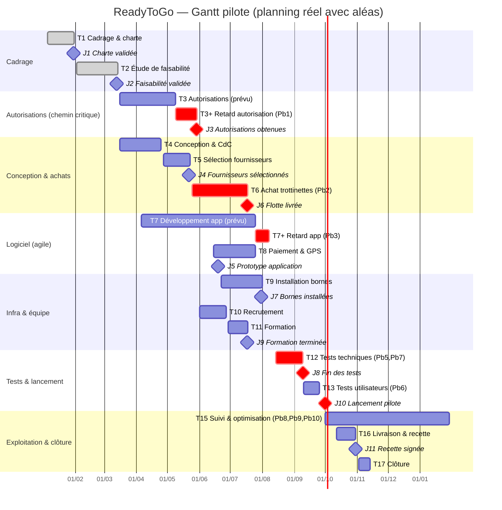

**Chemin critique (réel).** T1 → T2 → **T3/T3+ (autorisations, retardées)** → T5 → **T6 (achat, surcoût)** → **T12 (tests, reprise)** → **J10 (lancement)**. Le lancement est décalé du 25/09 (prévu) au **01/10/2026** sous l'effet cumulé des aléas, absorbé par la réserve de délai.

> *Interprétation :* la comparaison entre le planning de référence (§3.3) et le planning réel montre concrètement l'impact des problèmes sur le calendrier. Le déport du développement logiciel en parallèle a **évité** que le retard d'autorisation ne bloque tout le projet.

> **Légende Gantt :** barres normales = tâches ; barres `crit` = tâches sur le chemin critique / à risque ; `done` = terminé ; losanges = jalons ; « + » = extension de durée liée à un problème simulé.

## 3.5 Jalons

| Jalon | Date | Condition de validation | Responsable | Décision attendue |
|---|---|---|---|---|
| J1 — Charte validée | 30/01/2026 | Charte approuvée par le sponsor | Membre 1 | Lancer l'étude |
| J2 — Faisabilité validée | 13/03/2026 | Recommandation favorable | Membre 4 | Engager le projet |
| J3 — Autorisations obtenues | 29/05/2026 | Accord écrit de l'autorité | Membre 1 | Installer les bornes |
| J4 — Fournisseurs sélectionnés | 22/05/2026 | Contrats signés (SLA) | Membre 4 | Commander |
| J5 — Prototype application | 19/06/2026 | Démo MVP concluante | Membre 2 | Poursuivre le dev |
| J6 — Flotte livrée | 17/07/2026 | Réception conforme | Membre 3 | Équiper & tester |
| J7 — Bornes installées | 31/07/2026 | PV d'installation | Membre 3 | Préparer les tests |
| J8 — Fin des tests | 09/09/2026 | Anomalies bloquantes levées | Membre 2 | Autoriser le lancement |
| J9 — Formation terminée | 17/07/2026 | Évaluation réussie | Membre 3 | Équipe opérationnelle |
| J10 — Lancement du pilote | 01/10/2026 | Prérequis réunis | Membre 1 | Ouvrir au public |
| J11 — Recette signée | 30/10/2026 | PV de recette signé | Membre 1 | Transférer à l'exploitation |
| J12 — Évaluation du pilote | 31/03/2027 | KPI atteints / analysés | Membre 4 | Décider de l'extension |
| J13 — Décision d'extension | 30/04/2027 | Business case phase 2 | Sponsor | Go/No-go phase 2 |
| J14 — Liaison vers le stade | 31/12/2029 | Bornes stade opérationnelles | Membre 3 | Préparer 2030 |
| J15 — Validation dispositif 2030 | 31/03/2030 | Plan de charge 2030 validé | Membre 1 | Activer le renfort |

> *Interprétation :* les jalons J1-J11 structurent le pilote ; J12-J13 conditionnent l'extension ; J14-J15 préparent 2030. Chaque jalon est un **point de décision** (go/no-go), cohérent avec la gouvernance (§2.7).

---

# 4. Organisation du travail (5 personnes) *(Étape 3)*

Le groupe est composé **exactement de cinq membres**. Toutes les tâches du projet et toutes les parties du rapport sont réparties entre eux, avec une charge équilibrée (contributions proches de 20 % par personne, total 100 %).

## 4.1 Rôles des membres

| Membre | Rôle | Responsabilités principales |
|---|---|---|
| **Membre 1** | Chef de projet & coordination | Cadrage ; objectifs SMART ; planning général ; coordination ; réunions ; suivi des jalons ; consolidation et validation du rapport. |
| **Membre 2** | Responsable technique & application | Cahier des charges technique ; application mobile ; GPS ; QR codes ; verrouillage ; paiement ; cybersécurité ; tests techniques ; relation prestataires techniques. |
| **Membre 3** | Responsable opérations, flotte & logistique | Choix des trottinettes ; bornes ; déploiement ; recharge ; redistribution ; maintenance ; stock de pièces ; préparation des jours de match. |
| **Membre 4** | Responsable finances, achats & risques | Budget ; achats ; analyse des coûts ; prévision des revenus ; rentabilité ; simulation EVM ; registre des risques ; plans de réponse. |
| **Membre 5** | Responsable communication & parties prenantes | Analyse des parties prenantes ; communication ; marketing ; identité ReadyToGo ; relations partenaires envisagés ; expérience utilisateur ; satisfaction ; retours d'expérience. |

## 4.2 Règles de répartition

- La charge est **équilibrée** (≈ 20 % par membre) et tient compte de la **difficulté** et de la **durée** des tâches.
- Chaque tâche a **un responsable principal unique** ; un membre peut être **en soutien**.
- Les **prestataires externes** peuvent exécuter certaines actions, mais un membre en assure toujours **le suivi**.
- Le chef de projet **coordonne** mais ne rédige pas seul la majorité du rapport.
- Chaque membre produit des **livrables mesurables** ; le total des contributions est égal à **100 %**.

## 4.3 Tableau de répartition des tâches

| Tâche | Sous-tâche | Responsable | Soutien | Début | Fin | Charge estimée | Livrable | Critère de validation | Statut |
|---|---|---|---|---|---|---|---|---|---|
| Cadrage | Charte, gouvernance | M1 | M4 | 05/01/26 | 30/01/26 | 8 j | Charte | Approbation sponsor | Terminé |
| Faisabilité | Analyse tech/éco/juri | M4 | M1,M2 | 02/02/26 | 13/03/26 | 12 j | Étude | Recommandation validée | Terminé |
| Autorisations | Dossier domaine public | M1 | M5 | 16/03/26 | 29/05/26 | 10 j | Dossier | Accord écrit | Terminé (retard Pb1) |
| Conception | Cahier des charges | M2 | M3 | 16/03/26 | 24/04/26 | 12 j | CdC | Exigences validées | Terminé |
| Achats | Sélection & commande | M4 | M3 | 27/04/26 | 17/07/26 | 10 j | Contrats | Contrats signés | Terminé (surcoût Pb2) |
| Flotte | Réception trottinettes | M3 | M4 | 25/05/26 | 17/07/26 | 12 j | Flotte | Réception conforme | Terminé |
| Application | MVP + back-office | M2 | — | 06/04/26 | 14/08/26 | 30 j | App MVP | Recette technique | Terminé (retard Pb3) |
| Paiement & GPS | Intégration | M2 | M3 | 15/06/26 | 14/08/26 | 12 j | Modules | Transaction test OK | Terminé |
| Bornes | Installation | M3 | — | 22/06/26 | 31/07/26 | 10 j | 12 bornes | PV installation | Terminé |
| Recrutement | Équipe locale | M5 | M1 | 01/06/26 | 26/06/26 | 6 j | Équipe | Postes pourvus | Terminé |
| Formation | Formation équipe | M3 | M5 | 29/06/26 | 17/07/26 | 6 j | Équipe formée | Évaluation réussie | Terminé |
| Tests | Technique + sécurité | M2 | M3 | 14/08/26 | 09/09/26 | 14 j | Rapport test | Anomalies levées | Terminé (Pb5, Pb7) |
| Tests utilisateurs | Pilote utilisateurs | M5 | M2 | 10/09/26 | 25/09/26 | 8 j | RETEX | Retours collectés | Terminé (Pb6) |
| Communication | Plan & supports | M5 | M1 | 01/05/26 | 26/06/26 | 10 j | Plan comm | Validé comité | Terminé |
| Risques | Registre & réponses | M4 | Tous | 02/02/26 | 30/10/26 | 8 j | Registre | Mises à jour régulières | En continu |
| Suivi/KPI/EVM | Tableau de bord | M4 | M1 | 01/10/26 | 30/10/26 | 8 j | Tableau bord | KPI alimentés | En continu |
| Lancement | Mise en service | M1 | M3,M2 | 01/10/26 | 01/10/26 | 4 j | Service ouvert | Prérequis réunis | Terminé |
| Livraison | Recette & transfert | M1 | Tous | 12/10/26 | 30/10/26 | 8 j | PV recette | PV signé | Terminé |
| Rédaction rapport | Toutes parties | Tous | M1 | 01/02/26 | 05/11/26 | 40 j | Rapport | Relecture croisée | Terminé |

> *Interprétation :* la charge est répartie de sorte qu'aucun membre ne concentre l'essentiel du travail. Le pic de charge de M2 (application + paiement/GPS + tests) est identifié et traité au §4.6 et via le Problème 4 (§7).

## 4.4 Répartition de la rédaction

| Membre | Parties rédigées |
|---|---|
| **Membre 1** | Résumé exécutif, introduction, objectifs SMART, planification, coordination, conclusion, harmonisation |
| **Membre 2** | Solution technique, application, GPS, paiement, cybersécurité, tests, recette technique |
| **Membre 3** | Flotte, bornes, logistique, maintenance, organisation opérationnelle, transfert vers l'exploitation |
| **Membre 4** | Budget, modèle économique, risques, KPI financiers, EVM, contrôle des coûts |
| **Membre 5** | Parties prenantes, communication, marketing, expérience utilisateur, retours d'expérience |

**Processus qualité de rédaction :** relecture croisée (chaque partie relue par un autre membre) → correction collective → réunion finale de validation → vérification du plagiat → harmonisation de la mise en forme (charte graphique, styles de titres, tableaux).

## 4.5 Matrice RACI

*Légende : **R** = Réalise · **A** = Approuve · **C** = Consulté · **I** = Informé. Une seule personne « A » par tâche.*

| Tâche | M1 | M2 | M3 | M4 | M5 |
|---|:---:|:---:|:---:|:---:|:---:|
| Définition du projet | **A/R** | C | C | C | C |
| Étude de faisabilité | C | C | C | **A/R** | I |
| Objectifs SMART | **A/R** | I | I | C | C |
| Autorisations | **A/R** | I | I | I | C |
| Budget | C | I | I | **A/R** | I |
| Achats | C | I | R | **A** | I |
| Application | I | **A/R** | I | C | I |
| Flotte | I | I | **A/R** | C | I |
| Bornes | C | I | **A/R** | I | I |
| Sécurité & cybersécurité | I | **A/R** | C | I | I |
| Risques | C | C | C | **A/R** | C |
| Communication | C | I | I | I | **A/R** |
| Tests | I | **A/R** | C | I | C |
| Formation | I | I | **A/R** | I | C |
| Lancement | **A** | R | R | I | C |
| KPI | C | I | I | **A/R** | C |
| EVM | C | I | I | **A/R** | I |
| Livraison | **A/R** | C | C | C | C |
| Rédaction | **A** | R | R | R | R |
| Relecture | **A** | R | R | R | R |
| Préparation soutenance | **A** | R | R | R | R |

> *Interprétation :* chaque ligne comporte **exactement un « A »**. Le chef de projet (M1) approuve les tâches transverses (définition, autorisations, lancement, livraison, rédaction) ; les leads de domaine approuvent leurs lots (M2 : application, sécurité, tests ; M3 : flotte, bornes, formation ; M4 : faisabilité, budget, achats, risques, KPI, EVM ; M5 : communication). Cette répartition évite la dilution des responsabilités.

## 4.6 Plan de charge

Capacité de référence sur la phase pilote (janvier-novembre 2026), exprimée en **jours-personne (j·p)** disponibles pour le projet (contexte étudiant, temps partiel). *Hypothèse de travail à valider.*

| Membre | Rôle | Capacité disponible | Charge prévue | Taux de charge | Période critique | Surcharge | Action corrective |
|---|---|---|---|---|---|---|---|
| M1 | Chef de projet | 70 j·p | 66 j·p | 94 % | Jan-Fév ; Oct-Nov | Non | RAS |
| M2 | Technique & app | 70 j·p | 78 j·p | **111 %** (pic **125 %** juin-août) | Juin-Août | **Oui** | Transfert doc → M1 ; suivi tests utilisateurs → M5 ; renfort prestataire (Pb3/Pb4) |
| M3 | Opérations & flotte | 70 j·p | 64 j·p | 91 % | Juin-Juil | Non | RAS (renfort ponctuel possible) |
| M4 | Finances & risques | 70 j·p | 62 j·p | 89 % | Fév-Mars ; Oct | Non | RAS |
| M5 | Communication & PP | 70 j·p | 60 j·p | 86 % | Mai-Juin ; Sept | Non | Absorbe une partie de la charge de M2 (tests utilisateurs) |

**Analyse.** La **période critique** est **juin-août 2026**, où se superposent développement application, intégration paiement/GPS et tests. Le membre **M2 dépasse 100 %** de sa capacité (pic à **125 %**, cf. Problème 4). Les **conflits** proviennent du chevauchement T7-T8-T12. Les **actions de rééquilibrage** consistent à transférer la documentation à M1, le suivi des tests utilisateurs à M5, et à mobiliser un prestataire technique temporaire. Après rééquilibrage, le taux de M2 revient à ≈ 105 % (acceptable ponctuellement).

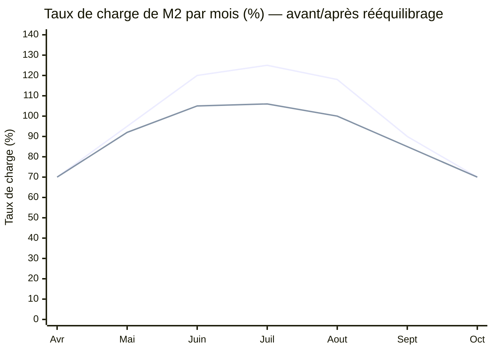

> *Interprétation :* la première courbe montre la surcharge simulée de M2 (pic 125 % en juillet) ; la seconde, l'effet des actions correctives (retour sous 106 %). Le seuil de 100 % reste dépassé ponctuellement mais devient soutenable.

## 4.7 Contribution individuelle

| Membre | Responsabilités | Parties rédigées | Livrables | Contribution estimée | Validation |
|---|---|---|---|---|---|
| M1 | Coordination, cadrage, planning | Résumé, intro, SMART, planif, conclusion | Charte, planning, PV recette, rapport final | **21 %** | Comité |
| M2 | Technique, application, sécurité | Solution technique, app, tests | App MVP, paiement, GPS, rapport de test | **20 %** | M1 |
| M3 | Opérations, flotte, logistique | Flotte, bornes, maintenance | Flotte, bornes, dispositif maintenance, formation | **20 %** | M1 |
| M4 | Finances, achats, risques | Budget, EVM, risques, KPI | Étude faisabilité, budget, registre risques, tableau de bord | **20 %** | M1 |
| M5 | Communication, parties prenantes | PP, communication, UX, RETEX | Plan de communication, identité, enquêtes satisfaction | **19 %** | M1 |
| **Total** | | | | **100 %** | |

> *Interprétation :* les contributions sont **proches de 20 %** par personne (écart maximal 2 points), conformément aux règles de répartition. La légère avance de M1 correspond à la charge d'harmonisation finale.

---

# 5. Gestion des risques *(Étape 4)*

## 5.1 Méthode

Chaque risque est évalué sur une échelle de **1 à 5** en **probabilité (P)** et en **impact (I)**. La **criticité = P × I** (de 1 à 25). Les niveaux sont définis ainsi :

| Criticité (P × I) | Niveau | Traitement attendu |
|---|---|---|
| 1 – 4 | 🟢 Faible | Accepter / surveiller |
| 5 – 9 | 🟡 Modéré | Réduire / plan simple |
| 10 – 14 | 🟠 Élevé | Réduire / transférer, plan formalisé |
| 15 – 25 | 🔴 Critique | Éviter / réduire en priorité, plan de secours obligatoire |

## 5.2 Registre des risques

| ID | Risque | Cause | Conséquence | P | I | Crit. | Niveau | Propriétaire | Réponse | Plan de secours |
|---|---|---|---|:--:|:--:|:--:|---|---|---|---|
| R01 | Vol | Attrait de revente, faible surveillance | Perte d'actifs, coûts | 4 | 3 | 12 | 🟠 Élevé | M3 | Réduire | GPS + verrouillage, alerte immobilisation, dépôt de plainte |
| R02 | Vandalisme | Dégradation volontaire | Réparations, indisponibilité | 4 | 3 | 12 | 🟠 Élevé | M3 | Réduire/Transférer | Assurance, pièces en stock, zones surveillées |
| R03 | Accidents | Mauvaise utilisation, voirie | Blessures, image, litige | 3 | 4 | 12 | 🟠 Élevé | M3 | Réduire | Limitation de vitesse, tutoriel, procédure accident |
| R04 | Retard des autorisations | Dossier incomplet, délais admin. | Décalage installation & lancement | 4 | 4 | 16 | 🔴 Critique | M1 | Éviter/Réduire | Réserve de délai, avancer les tests app, relance mairie |
| R05 | Réglementation défavorable | Cadre juridique évolutif | Restriction/interdiction zones | 2 | 5 | 10 | 🟠 Élevé | M1 | Réduire | Dialogue mairie, plan de repli géographique |
| R06 | Batteries à plat | Recharge insuffisante | Trottinettes indisponibles | 3 | 2 | 6 | 🟡 Modéré | M3 | Réduire | Batteries de secours, planning de recharge |
| R07 | Incident de batterie | Défaut, surchauffe | Sécurité, retrait de lot | 2 | 5 | 10 | 🟠 Élevé | M3 | Éviter/Réduire | Fournisseur certifié, retrait immédiat, procédure incendie |
| R08 | Panne de l'application | Bug, surcharge serveur | Service interrompu | 3 | 4 | 12 | 🟠 Élevé | M2 | Réduire | Monitoring, sauvegardes, mode dégradé, hotline |
| R09 | Cyberattaque | Vulnérabilité, exposition | Interruption, atteinte confiance | 3 | 5 | 15 | 🔴 Critique | M2 | Éviter/Réduire | Pentest, MFA, cloisonnement, plan de réponse incident |
| R10 | Fuite de données | Faille, mauvaise config. | Sanction, perte de confiance | 2 | 5 | 10 | 🟠 Élevé | M2 | Réduire/Transférer | Chiffrement, minimisation, notification, assurance cyber |
| R11 | Échec du paiement | Panne passerelle | Perte de revenus, friction | 2 | 4 | 8 | 🟡 Modéré | M2 | Réduire/Transférer | Passerelle de secours, SLA prestataire |
| R12 | Indisponibilité de la flotte | Pannes cumulées | Perte de revenus, insatisfaction | 3 | 4 | 12 | 🟠 Élevé | M3 | Réduire | Maintenance préventive, stock de pièces, redistribution |
| R13 | Stationnement anarchique | Comportement usagers | Plaintes, image, risque piéton | 4 | 3 | 12 | 🟠 Élevé | M5 | Réduire | Géofencing bloquant, sensibilisation, signalétique |
| R14 | Faible adoption | Emplacements, prix, notoriété | Revenus < prévisions | 3 | 4 | 12 | 🟠 Élevé | M5 | Réduire | Enquête, offres lancement, partenariats, repositionnement |
| R15 | Opposition des habitants | Nuisances perçues | Blocage local, image | 3 | 3 | 9 | 🟡 Modéré | M5 | Réduire | Concertation, charte de bon usage, médiation |
| R16 | Retard fournisseur | Approvisionnement, logistique | Décalage flotte/bornes | 4 | 3 | 12 | 🟠 Élevé | M4 | Réduire/Transférer | Clause SLA, fournisseur alternatif, pénalités |
| R17 | Hausse des coûts | Composants, transport, change | Dépassement budgétaire | 4 | 3 | 12 | 🟠 Élevé | M4 | Réduire | Réserve pour risques, négociation, révision des postes |
| R18 | Concurrence | Copie rapide du concept | Pression sur les prix/parts | 3 | 3 | 9 | 🟡 Modéré | M5 | Accepter/Réduire | Différenciation service, contrats partenaires |
| R19 | Surcharge pendant les matchs | Pics de demande 2030 | Rupture de service | 3 | 4 | 12 | 🟠 Élevé | M3 | Réduire | Renfort équipes, redistribution dédiée, pass événements |
| R20 | Météo défavorable | Pluie, vent | Baisse d'usage, sécurité | 3 | 2 | 6 | 🟡 Modéré | M3 | Accepter | Communication, ajustement de l'offre |
| R21 | Difficultés de maintenance | Compétences, pièces | Délai de réparation élevé | 3 | 3 | 9 | 🟡 Modéré | M3 | Réduire | Formation, contrat pièces, procédures standard |

> *Interprétation :* deux risques sont **critiques** — **R04 (retard des autorisations, criticité 16)** et **R09 (cyberattaque, criticité 15)**. Ils se matérialisent d'ailleurs dans la simulation (§7, Problèmes 1 et 7), ce qui justifie l'attention prioritaire qui leur est portée.

## 5.3 Matrice probabilité-impact (5 × 5)

| P ↓ \ I → | **1** | **2** | **3** | **4** | **5** |
|---|---|---|---|---|---|
| **5** | | | | | |
| **4** | | | 🟠 R01, R02, R13, R16, R17 | 🔴 **R04** | |
| **3** | | 🟡 R06, R20 | 🟡 R15, R18, R21 | 🟠 R03, R08, R12, R14, R19 | 🔴 **R09** |
| **2** | | | | 🟡 R11 | 🟠 R05, R07, R10 |
| **1** | | | | | |

> *Interprétation :* la masse des risques se concentre dans la zone **probabilité moyenne-élevée / impact moyen-élevé**, cohérente avec un projet de déploiement physique + numérique. Les deux cases critiques (R04, R09) commandent des plans de secours obligatoires.

## 5.4 Plans de réponse

Les quatre stratégies employées sont **Éviter, Réduire, Transférer, Accepter**. Les mesures transverses ci-dessous couvrent plusieurs risques à la fois :

| Mesure | Stratégie | Risques couverts |
|---|---|---|
| GPS + verrouillage électronique | Réduire | R01, R02 |
| Géofencing (zones autorisées) | Réduire | R13, R15 |
| Limitation de vitesse / zones à vitesse réduite | Réduire | R03, R19 |
| Assurance (RC, flotte, cyber) | Transférer | R02, R07, R10, R11 |
| Maintenance préventive + stock de pièces | Réduire | R06, R12, R21 |
| Batteries de secours & planning de recharge | Réduire | R06, R12 |
| Sauvegardes + monitoring | Réduire | R08 |
| Tests de cybersécurité (pentest, MFA) | Éviter/Réduire | R09, R10 |
| Contrats avec niveau de service (SLA) | Transférer | R11, R16 |
| Plan de continuité d'activité | Réduire | R04, R08, R09, R19 |
| Communication avec la mairie | Réduire | R04, R05, R15 |
| Procédures de gestion des accidents | Réduire | R03, R07 |
| Réserve pour risques (budget) | Accepter (financer) | R17, R16 |

> *Interprétation :* la stratégie dominante est **Réduire** (mesures préventives), complétée par **Transférer** (assurances, SLA) pour les risques à fort impact et faible contrôlabilité. Les mesures alimentent directement les livrables techniques (GPS, géofencing, cybersécurité) et le budget (réserve pour risques, assurances). Les risques matérialisés sont suivis dans le **journal des problèmes** (§7).

---

# 6. Plan de communication *(Étape 5)*

## 6.1 Objectifs de communication

| Public | Objectif de communication |
|---|---|
| Équipe (5 membres) | Aligner, coordonner, décider vite, tracer les décisions |
| Autorités / mairie | Rassurer sur l'ordre public et la sécurité, obtenir et maintenir les autorisations |
| Partenaires (hôtels, transport) | Susciter l'adhésion, préparer des accords à négocier |
| Habitants | Informer, prévenir les nuisances (stationnement), favoriser l'acceptabilité |
| Étudiants | Faire connaître l'offre, recruter des utilisateurs et des ambassadeurs |
| Touristes | Simplifier l'usage (multilingue), valoriser le service (2030) |
| Médias | Donner une image maîtrisée et crédible du projet |
| Investisseurs potentiels | Démontrer la rigueur de gestion et la maîtrise des risques |

## 6.2 Tableau des canaux, messages et supports

| Public | Objectif | Message | Canal | Support | Fréquence | Responsable | Indicateur |
|---|---|---|---|---|---|---|---|
| Équipe | Coordonner | « Où en est-on, quels blocages ? » | Réunion | Compte rendu | Hebdomadaire | M1 | Taux de présence |
| Équipe | Décider | « Décisions et arbitrages » | Comité de pilotage | Relevé de décisions | Mensuelle | M1 | Décisions tracées |
| Mairie/autorités | Rassurer | « Sécurité, stationnement ordonné, conformité » | Réunion / courrier | Dossier, note | Aux jalons | M1 (S: M5) | Autorisation maintenue |
| Partenaires | Convaincre | « Valeur ajoutée pour vos clients » | Rendez-vous | Présentation | Mensuelle | M5 | Accords en négociation |
| Habitants | Informer | « Comment bien garer, où rouler » | Affichage / réseaux sociaux | Visuels, FAQ | Continue | M5 | Portée, plaintes |
| Étudiants | Recruter | « Offre étudiante, rapidité » | Réseaux sociaux / campus | Posts, offres | Hebdomadaire | M5 | Inscriptions |
| Touristes | Faciliter | « Simple, multilingue » | Application / hôtels / gare | Notifications, flyers | Continue (2030) | M5 | Trajets touristes |
| Médias | Crédibiliser | « Projet structuré et responsable » | Communiqué | Dossier de presse | Aux jalons | M5 (S: M1) | Retombées presse |
| Investisseurs | Convaincre | « Gestion rigoureuse, risques maîtrisés » | Rendez-vous | Business case | Trimestrielle | M4 (S: M1) | Intérêt exprimé |
| Utilisateurs | Fidéliser | « Nouveautés, sécurité, bon usage » | Application | Notifications, tutoriel | Continue | M2 (S: M5) | Rétention, note |

> *Interprétation :* le plan couvre les publics prioritaires identifiés dans la matrice pouvoir/intérêt (§2.6). Les canaux numériques (application, réseaux sociaux) servent l'acquisition et la fidélisation ; les canaux institutionnels (réunions, courriers) sécurisent les autorisations et partenariats.

## 6.3 Matrice de communication

| Information | Producteur | Destinataire | Format | Fréquence | Canal | Délai | Validation | Archivage |
|---|---|---|---|---|---|---|---|---|
| Compte rendu hebdomadaire | M1 | Équipe | Note | Hebdomadaire | E-mail | J+1 | M1 | Espace partagé |
| Rapport mensuel | M1 | Comité/sponsor | Rapport | Mensuelle | Réunion + e-mail | J+2 | Sponsor | Espace partagé |
| Suivi budgétaire | M4 | Comité | Tableau | Mensuelle | Tableau de bord | J+3 | M1 | Espace partagé |
| Registre des risques | M4 | Comité | Tableau | Mensuelle (+ ad hoc) | Tableau de bord | J+2 | M1 | Espace partagé |
| Rapport d'incident | M3/M2 | M1 + concernés | Formulaire | À l'événement | E-mail / app | ≤ 24 h | M1 | Registre incidents |
| Rapport de test | M2 | Comité | Rapport | Fin de test | E-mail | J+2 | M1 | Espace partagé |
| Demande de changement | Demandeur | Comité | Formulaire | À la demande | Outil de suivi | J+3 | Comité | Registre changements |
| Comité de pilotage | M1 | Sponsor + membres | Relevé de décisions | Mensuelle | Réunion | J+1 | Sponsor | Espace partagé |
| Communication de crise | M5 | Publics concernés | Message validé | À l'événement | Multi-canal | ≤ 2 h | M1 | Registre crise |
| Rapport de clôture | M1 | Sponsor | Rapport | Fin de projet | Réunion + e-mail | J+5 | Sponsor | Espace partagé |

> *Interprétation :* la matrice fixe **qui produit quoi, pour qui, quand et comment**, avec un **délai** et une **validation** explicites. Elle garantit la traçabilité (archivage systématique) et alimente la gouvernance (§2.7).

## 6.4 Communication de crise

Principe : **une seule voix** (porte-parole = M5, validation M1), un **message factuel et rapide** (≤ 2 h), la **priorité à la sécurité**, puis un suivi jusqu'à résolution.

| Scénario de crise | Première action (≤ 2 h) | Message clé | Canal | Suivi |
|---|---|---|---|---|
| Accident grave | Sécuriser, alerter secours | « Sécurité prioritaire, enquête en cours » | Communiqué + app | Rapport d'incident, mesures |
| Panne générale | Activer le mode dégradé | « Interruption temporaire, rétablissement en cours » | App + réseaux sociaux | Post-mortem technique |
| Fuite de données | Contenir, notifier | « Mesures prises, données protégées » | E-mail utilisateurs + communiqué | Notification autorités |
| Problème de batterie | Retirer le lot concerné | « Retrait préventif par précaution » | App + affichage | Contrôle fournisseur |
| Vandalisme massif | Constater, déposer plainte | « Renforcement de la surveillance » | Réseaux sociaux | Assurance, réparation |
| Interruption du paiement | Basculer passerelle de secours | « Paiement rétabli, aucun débit erroné » | App | SLA prestataire |
| Polémique réseaux sociaux | Répondre factuellement | « Voici les faits et nos actions » | Réseaux sociaux | Veille renforcée |

> *Interprétation :* ces procédures relient directement les risques critiques/élevés (§5.2) à une réponse communicationnelle prête à l'emploi, réduisant le délai de réaction en situation réelle.

---

# 7. Simulation des problèmes rencontrés

> 🟡 **Cadre pédagogique :** cette partie est une **simulation** destinée à démontrer la capacité de pilotage de l'équipe. ReadyToGo n'est **pas** présenté comme un projet parfait : certains risques du §5 **se matérialisent réellement** dans le scénario et **modifient** le planning (§3.4), le budget (§10.1), le plan de charge (§4.6), les KPI (§8.1) et la courbe EVM (§8.2).

## 7.1 Journal des problèmes rencontrés

| ID | Date | Phase | Problème | Cause | Responsable | Impact coût | Impact délai | Impact qualité | Action corrective | Statut | Leçon apprise |
|---|---|---|---|---|---|---|---|---|---|---|---|
| P1 | 05/2026 | Autorisations | Retard d'autorisation municipale | Dossier initial incomplet | M1 | ~ +5 000 DH | **+3 sem** | Périmètre préservé | Compléter le dossier, avancer les tests app, utiliser la réserve de délai | ✅ Résolu | Anticiper et sécuriser les autorisations tôt |
| P2 | 06/2026 | Achats | Hausse du prix des trottinettes (+8 %) | Transport & composants | M4 | **+72 000 DH** | 0 | Qualité maintenue | Négocier, modèles alternatifs, réserve pour risques | ✅ Résolu | Sécuriser les prix (clauses), garder une réserve |
| P3 | 07/2026 | Développement | Retard de l'application (paiement + GPS) | Complexité d'intégration | M2 | +25 000 DH | **+2 sem** | MVP recentré | Prioriser, MVP, reporter fonctions secondaires, prestataire | ✅ Résolu | Découper en MVP, tester chaque sprint |
| P4 | 06-08/2026 | Développement/Tests | Surcharge de M2 (> 120 %) | Cumul dev + tests | M1 | +15 000 DH | 0 (évité) | Risque d'erreurs réduit | Transferts de tâches, renfort externe, plan de charge màj | ✅ Résolu | Surveiller le plan de charge, rééquilibrer tôt |
| P5 | 08/2026 | Tests | Pannes de 12/150 trottinettes | Défauts fournisseur | M3 | +20 000 DH (part fournisseur) | **+5 j** | Dispo. flotte 92 % | Contrôle complet, retrait, réparation/remplacement fournisseur, nouvelle recette | ⚠️ Surveillé | Recette rigoureuse à la réception |
| P6 | 09/2026 | Tests utilisateurs | Stationnement hors zone | Comportement usagers | M5 | +8 000 DH | 0 | Satisfaction en baisse | Géofencing bloquant, messages app, signalétique, sensibilisation | ⚠️ Surveillé | Contraindre + éduquer le stationnement |
| P7 | 09/2026 | Tests sécurité | Incident de cybersécurité (vulnérabilité) | Faille détectée en pentest | M2 | +18 000 DH | **+5 j** | Sécurité renforcée | Correction, revue des accès, MFA, test d'intrusion, validation obligatoire | ✅ Résolu | Cybersécurité dès la conception |
| P8 | 10/2026 | Exploitation | Adoption plus faible que prévu | Emplacements, notoriété | M5 | +15 000 DH (marketing) | 0 | KPI usage sous cible | Enquête, réimplantation bornes, offre lancement, partenariats | ⚠️ Ouvert | Réviser les hypothèses de revenus |
| P9 | 11/2026 | Exploitation | Accident mineur (sans gravité) | Mauvaise utilisation | M3 | +5 000 DH | 0 | Sécurité à renforcer | Assistance, analyse, tutoriel obligatoire, bridage débutants | ⚠️ Surveillé | Onboarding sécurité obligatoire |
| P10 | 11/2026 | Exploitation | Demande d'ajout d'une zone (gare) | Pression partie prenante | M1 | 0 (reporté) | 0 | Périmètre protégé | Demande de changement, analyse d'impact, report en phase 2 | ⚠️ Ouvert | Discipline de périmètre (anti-dérive) |

> *Interprétation :* les problèmes se répartissent sur **toutes les phases**. Quatre d'entre eux (P1, P2, P3, P5) ont un impact direct et mesurable sur le calendrier et le budget et sont donc développés en priorité, car ils modifient concrètement le Gantt, le budget, le plan de charge et la courbe EVM.

## 7.2 Problèmes détaillés

### Problème 1 — Retard dans l'autorisation municipale
1. **Phase / date :** Autorisations — mai 2026. 2. **Description :** la demande d'occupation de l'espace public prend **3 semaines de plus** que prévu. 3. **Cause :** dossier initial incomplet. 4. **Signaux d'alerte :** absence d'accusé de réception, demandes de pièces complémentaires. 5. **Personnes concernées :** M1 (pilote), M5 (relation mairie), M3 (installation bornes en aval). 6. **Impact coût :** faible (~5 000 DH de constitution de dossier). 7. **Impact délai :** +3 semaines sur le chemin critique. 8. **Impact qualité/périmètre :** nul (périmètre préservé). 9. **Décision de l'équipe :** ne pas attendre passivement — réordonnancer. 10. **Actions correctives :** M1 met à jour le planning ; M5 organise une réunion avec les parties prenantes ; l'équipe complète les documents ; les **tests de l'application sont avancés** ; une **réserve de délai** est consommée. 11. **Responsable de l'action :** M1. 12. **Résultat :** autorisation obtenue le 29/05/2026, retard partiellement absorbé. 13. **Leçon apprise :** engager les démarches administratives au plus tôt et faire vérifier la complétude du dossier.

### Problème 2 — Augmentation du prix des trottinettes
1. **Phase / date :** Achats — juin 2026. 2. **Description :** le fournisseur augmente son prix de **8 %**. 3. **Cause :** coût du transport et de certains composants. 4. **Signaux :** révision de devis, hausse des indices matières. 5. **Concernés :** M4 (budget/achats), M3 (flotte). 6. **Impact coût :** **+72 000 DH** (8 % de 900 000 DH). 7. **Impact délai :** nul. 8. **Impact qualité :** aucune baisse (la sécurité et la qualité des trottinettes **ne sont pas réduites**). 9. **Décision :** absorber le surcoût sans dégrader la qualité. 10. **Actions :** M4 négocie avec plusieurs fournisseurs ; M3 analyse des modèles alternatifs ; une **dépense non prioritaire est réduite** ; une partie de la **réserve pour risques** est utilisée. 11. **Responsable :** M4. 12. **Résultat :** surcoût contenu, CPI dégradé temporairement (§8.2). 13. **Leçon :** sécuriser les prix par des clauses et maintenir une réserve.

### Problème 3 — Retard de l'application mobile
1. **Phase / date :** Développement — juillet 2026. 2. **Description :** l'intégration du paiement et du GPS prend **2 semaines** de plus. 3. **Cause :** complexité d'intégration technique. 4. **Signaux :** vélocité de sprint en baisse, bugs récurrents. 5. **Concernés :** M2 (dev), M1 (planning). 6. **Impact coût :** +25 000 DH (prestataire). 7. **Impact délai :** +2 semaines (le logiciel devient critique). 8. **Impact qualité :** MVP recentré (fonctions secondaires reportées). 9. **Décision :** livrer un **MVP** plutôt qu'un produit complet en retard. 10. **Actions :** priorisation des fonctionnalités ; **version minimale fonctionnelle** ; report de fonctions secondaires ; **prestataire technique supplémentaire** ; tests en fin de chaque sprint. 11. **Responsable :** M2. 12. **Résultat :** MVP livré le 14/08/2026, SPI dégradé puis redressé (§8.2, §8.3). 13. **Leçon :** découper en MVP et tester à chaque itération.

### Problème 4 — Surcharge d'un membre
1. **Phase / date :** Développement/Tests — juin à août 2026. 2. **Description :** M2 dépasse **120 %** de sa capacité (pic 125 %). 3. **Cause :** cumul développement + tests. 4. **Signaux :** dépassements d'horaires, retards de validation. 5. **Concernés :** M2, M1, M5. 6. **Impact coût :** +15 000 DH (assistance externe). 7. **Impact délai :** évité grâce au rééquilibrage. 8. **Impact qualité :** risque d'erreurs et de fatigue réduit. 9. **Décision :** rééquilibrer la charge. 10. **Actions :** documentation transférée à M1 ; suivi des tests utilisateurs transféré à M5 ; planning rééquilibré ; assistance externe temporaire ; **plan de charge mis à jour** (§4.6). 11. **Responsable :** M1. 12. **Résultat :** taux de M2 ramené sous 106 %. 13. **Leçon :** surveiller le plan de charge et agir dès le dépassement.

### Problème 5 — Pannes pendant les tests
1. **Phase / date :** Tests — août 2026. 2. **Description :** **12 trottinettes sur 150** présentent des défauts (batterie, freinage, verrouillage). 3. **Cause :** défauts fournisseur. 4. **Signaux :** anomalies répétées en contrôle. 5. **Concernés :** M3 (flotte), M2 (verrouillage). 6. **Impact coût :** ~20 000 DH (à la charge du fournisseur en partie). 7. **Impact délai :** +5 j (report de la validation technique). 8. **Impact qualité :** **disponibilité initiale limitée à 92 %**. 9. **Décision :** ne pas valider tant que le taux cible n'est pas atteint. 10. **Actions :** M3 organise un **contrôle complet** ; M2 vérifie le verrouillage ; les unités défectueuses sont **retirées** ; le fournisseur **répare ou remplace** ; une **nouvelle recette technique** est organisée. 11. **Responsable :** M3. 12. **Résultat :** disponibilité rétablie ; **risque R12/R02 sous surveillance**. 13. **Leçon :** exiger une recette rigoureuse à la réception (SLA fournisseur).

### Problème 6 — Stationnement incorrect
1. **Phase / date :** Tests utilisateurs — septembre 2026. 2. **Description :** plusieurs trottinettes sont laissées hors des zones autorisées. 3. **Cause :** comportement des usagers. 4. **Signaux :** plaintes de riverains, signalements. 5. **Concernés :** M5 (communication), M3 (redistribution). 6. **Impact coût :** +8 000 DH (signalétique + campagne). 7. **Impact délai :** nul. 8. **Impact qualité :** baisse de satisfaction, risque piéton. 9. **Décision :** contraindre techniquement + sensibiliser. 10. **Actions :** **géofencing** empêchant la fin de trajet hors zone ; messages dans l'application ; **signalétique** supplémentaire ; campagne de sensibilisation (M5) ; suivi du **taux de stationnement conforme** (KPI). 11. **Responsable :** M5. 12. **Résultat :** taux conforme en amélioration ; **risque R13 sous surveillance**. 13. **Leçon :** combiner contrainte technique et pédagogie.

### Problème 7 — Incident de cybersécurité
1. **Phase / date :** Tests de sécurité — septembre 2026. 2. **Description :** une **vulnérabilité** est détectée ; **aucun vol de données réel**, mais le lancement est temporairement suspendu. 3. **Cause :** faille identifiée lors d'un test. 4. **Signaux :** alerte du test d'intrusion. 5. **Concernés :** M2 (technique). 6. **Impact coût :** +18 000 DH (correction + nouveau test). 7. **Impact délai :** +5 j. 8. **Impact qualité :** sécurité renforcée. 9. **Décision :** ne pas lancer avant correction validée. 10. **Actions :** **correction immédiate** ; revue et modification des accès ; **renforcement de l'authentification (MFA)** ; **test d'intrusion supplémentaire** ; validation obligatoire avant mise en service. 11. **Responsable :** M2. 12. **Résultat :** vulnérabilité corrigée, lancement autorisé le 01/10/2026 ; **risque R09 traité**. 13. **Leçon :** intégrer la cybersécurité dès la conception (*security by design*).

### Problème 8 — Adoption plus faible que prévu
1. **Phase / date :** Exploitation — octobre 2026 (1ᵉʳ mois). 2. **Description :** le nombre moyen de trajets par trottinette est **inférieur à l'objectif**. 3. **Cause :** emplacements des bornes, notoriété insuffisante. 4. **Signaux :** KPI d'usage sous cible, revenus sous prévisions. 5. **Concernés :** M5 (communication), M4 (revenus). 6. **Impact coût :** +15 000 DH (offre de lancement, marketing). 7. **Impact délai :** nul. 8. **Impact qualité/modèle :** risque sur le modèle économique. 9. **Décision :** comprendre puis stimuler l'usage. 10. **Actions :** **enquête utilisateurs** ; amélioration de l'**emplacement des bornes** ; **offre de lancement** limitée ; partenariats **envisagés** avec hôtels et établissements étudiants ; meilleure communication ; **révision des hypothèses de revenus** (§10.2). 11. **Responsable :** M5. 12. **Résultat :** usage en progression ; **objectif non encore atteint → problème ouvert**. 13. **Leçon :** ne pas surestimer l'adoption ; prévoir des leviers d'activation.

### Problème 9 — Accident mineur pendant le pilote
1. **Phase / date :** Exploitation — novembre 2026. 2. **Description :** un utilisateur **chute sans blessure grave** (mauvaise utilisation). 3. **Cause :** usage inapproprié. 4. **Signaux :** premier signalement d'incident. 5. **Concernés :** M3 (opérations/sécurité). 6. **Impact coût :** ~5 000 DH (tutoriel, inspection). 7. **Impact délai :** nul. 8. **Impact qualité :** consignes de sécurité à revoir. 9. **Décision :** renforcer la prévention. 10. **Actions :** **assistance immédiate** ; analyse de l'incident ; inspection de la trottinette ; **tutoriel obligatoire** dans l'application ; **limitation de vitesse pour les nouveaux utilisateurs** ; amélioration de la signalétique ; suivi du **taux d'incidents**. 11. **Responsable :** M3. 12. **Résultat :** mesures déployées ; **risque R03 sous surveillance**. 13. **Leçon :** rendre l'onboarding sécurité obligatoire.

### Problème 10 — Demande de modification du périmètre
1. **Phase / date :** Exploitation — novembre 2026. 2. **Description :** une partie prenante demande d'**ajouter immédiatement une zone près de la gare**, non incluse dans le pilote. 3. **Cause :** pression d'une partie prenante. 4. **Signaux :** demande formulée hors cadre. 5. **Concernés :** M1 (périmètre), M4 (coût), M3 (flotte/bornes). 6. **Impact coût :** 0 (demande reportée). 7. **Impact délai :** 0 (report). 8. **Impact périmètre :** risque de **dérive** (scope creep). 9. **Décision :** appliquer le processus de changement. 10. **Actions :** création d'une **demande officielle de changement** (§8.4) ; **analyse d'impact** (coût, délai, qualité, ressources) ; décision du **comité de pilotage** ; **report en phase 2** ; mise à jour du périmètre **uniquement après validation**. 11. **Responsable :** M1. 12. **Résultat :** périmètre pilote protégé ; demande **inscrite en phase 2 → ouverte**. 13. **Leçon :** discipline de périmètre et gouvernance du changement.

## 7.3 Cohérence avec le reste du rapport

Les problèmes simulés **modifient réellement** les autres parties :

- **Gantt (§3.4) :** le planning « réel » intègre les retards P1 (+3 sem), P3 (+2 sem) et la reprise de tests (P5, P7) ; le lancement passe du 25/09 au 01/10/2026.
- **Budget (§10.1) :** les surcoûts P2 (+72 k), P3 (+25 k), P4 (+15 k), P5 (+20 k), P6 (+8 k), P7 (+18 k), P8 (+15 k), P9 (+5 k) sont financés par la **réserve pour risques** et des arbitrages ; ils expliquent l'écart AC/BAC de l'EVM.
- **Plan de charge (§4.6) :** P4 fait apparaître la surcharge de M2 (pic 125 %) et les rééquilibrages.
- **RACI (§4.5) :** les actions correctives respectent les responsabilités (M1 planning/périmètre, M2 technique/sécurité, M3 flotte, M4 coûts, M5 communication).
- **Registre des risques (§5.2) :** P1↔R04, P2↔R17, P3↔R08, P5↔R12/R02, P6↔R13, P7↔R09, P8↔R14, P9↔R03, P10↔dérive de périmètre.
- **KPI (§8.1) :** disponibilité (92 % lors de P5), stationnement conforme (P6), usage (P8), incidents (P9) évoluent sous l'effet des problèmes puis des corrections.
- **EVM (§8.2) :** le retard application (P3) et le surcoût équipements (P2) créent une période **SPI < 1** et **CPI < 1**, suivie d'un redressement.
- **RETEX (§9.4) et réserves de livraison (§9.1) :** les problèmes non totalement clos (P5, P6, P8, P9, P10) sont consignés comme **réserves** ou points de surveillance.

**Tous les problèmes ne sont pas résolus immédiatement.** P8 et P10 restent **ouverts** ; P5, P6, P9 restent **sous surveillance** après le lancement.

> **Analyse de synthèse — ce que révèle la simulation.** La réussite d'un projet ne signifie pas l'absence de problèmes, mais la **capacité de l'équipe à** : (1) **détecter** les écarts tôt (signaux d'alerte, KPI, EVM) ; (2) **communiquer** rapidement (comité, escalade) ; (3) **décider** (arbitrages, MVP, report) ; (4) **adapter le planning** (réordonnancement, réserve de délai) ; (5) **contrôler les coûts** (réserve pour risques, négociation) ; (6) **protéger la qualité et la sécurité** (recette, géofencing, cybersécurité) ; (7) **tirer des leçons** pour les phases suivantes. C'est cette **résilience organisée**, plus qu'une exécution sans accroc, qui caractérise une bonne gestion de projet.

---

# 8. Suivi et indicateurs *(Étape 6)*

## 8.1 KPI

Cinq KPI principaux couvrent le délai, le coût, la disponibilité, l'usage et la satisfaction/sécurité.

| KPI | Définition | Formule | Source | Fréquence | Responsable | Cible | Seuil d'alerte | Action corrective |
|---|---|---|---|---|---|---|---|---|
| **K1 — Respect du délai** | Part des jalons tenus | (Jalons à l'heure ÷ jalons prévus) × 100 | Planning | Mensuelle | M1 | ≥ 90 % | < 80 % | Réordonnancer, réserve de délai |
| **K2 — Respect du budget** | Performance des coûts | CPI = EV ÷ AC | Suivi budgétaire | Mensuelle | M4 | ≥ 0,95 | < 0,90 | Négocier, réserve, arbitrages |
| **K3 — Disponibilité de la flotte** | Part de la flotte en service | (Trottinettes dispo ÷ flotte totale) × 100 | Back-office | Quotidienne | M3 | ≥ 90 % | < 85 % | Maintenance, redistribution |
| **K4 — Usage** | Trajets par trottinette et par jour | Trajets ÷ (flotte × jours) | Application | Quotidienne | M5 | ≥ 5 | < 3,1 (point mort) | Offres, réimplantation, marketing |
| **K5 — Satisfaction / sécurité** | Note moyenne & incidents | Note in-app ; incidents / 1 000 trajets | Enquête / registre | Mensuelle | ≥ 4/5 ; ≤ 1,5 | < 3,5 ; > 2,5 | Tutoriel, bridage, corrections |

*Indicateurs secondaires suivis : délai moyen de réparation (≤ 48 h), taux de stationnement conforme (≥ 85 %).*

> *Interprétation :* ces KPI sont directement dérivés des objectifs SMART (§2.3) et reliés aux problèmes simulés : K3 chute à 92 % lors du Problème 5, K4 passe sous la cible lors du Problème 8, K5 est sollicité par les Problèmes 6 et 9. Le seuil d'alerte de K4 (3,1) correspond au **point mort** calculé au §10.3.

## 8.2 Simulation EVM

**Cadre.** Référentiel de mesure (PMB) du pilote : **BAC = 2 000 000 DH** (base de coût, hors réserve de gestion). Suivi mensuel sur l'année 2026. Les valeurs sont **cumulées**.

**Formules.** SV = EV − PV · CV = EV − AC · SPI = EV ÷ PV · CPI = EV ÷ AC · EAC = BAC ÷ CPI · ETC = EAC − AC · VAC = BAC − EAC.

| Mois (2026) | PV (DH) | EV (DH) | AC (DH) | SV (DH) | CV (DH) | SPI | CPI |
|---|--:|--:|--:|--:|--:|:--:|:--:|
| Jan | 60 000 | 55 000 | 60 000 | −5 000 | −5 000 | 0,92 | 0,92 |
| Fév | 150 000 | 130 000 | 140 000 | −20 000 | −10 000 | 0,87 | 0,93 |
| Mar | 300 000 | 250 000 | 270 000 | −50 000 | −20 000 | 0,83 | 0,93 |
| Avr | 500 000 | 420 000 | 460 000 | −80 000 | −40 000 | 0,84 | 0,91 |
| Mai | 800 000 | 700 000 | 780 000 | −100 000 | −80 000 | 0,88 | 0,90 |
| **Juin** | 1 150 000 | 980 000 | 1 080 000 | **−170 000** | **−100 000** | **0,85** | **0,91** |
| Juil | 1 450 000 | 1 250 000 | 1 380 000 | −200 000 | −130 000 | 0,86 | 0,91 |
| Aoû | 1 700 000 | 1 520 000 | 1 650 000 | −180 000 | −130 000 | 0,89 | 0,92 |
| Sep | 1 850 000 | 1 700 000 | 1 840 000 | −150 000 | −140 000 | 0,92 | 0,92 |
| Oct | 1 940 000 | 1 850 000 | 1 990 000 | −90 000 | −140 000 | 0,95 | 0,93 |
| Nov | 1 990 000 | 1 950 000 | 2 080 000 | −40 000 | −130 000 | 0,98 | 0,94 |
| **Déc** | 2 000 000 | 2 000 000 | 2 130 000 | **0** | **−130 000** | **1,00** | **0,94** |

**Prévisions au point de contrôle de juin (situation la plus dégradée) :**
- EAC = BAC ÷ CPI = 2 000 000 ÷ 0,907 ≈ **2 204 000 DH**
- ETC = EAC − AC = 2 204 000 − 1 080 000 ≈ **1 124 000 DH**
- VAC = BAC − EAC = 2 000 000 − 2 204 000 ≈ **−204 000 DH** (dépassement prévu)

**Situation finale (décembre) :** EAC réel = AC = **2 130 000 DH** ; **VAC = −130 000 DH**. Le dépassement final (~6,5 %) est **inférieur** à la prévision de juin (−204 000 DH), grâce aux actions correctives, et **absorbé par la réserve pour risques**.

### Courbe PV / EV / AC

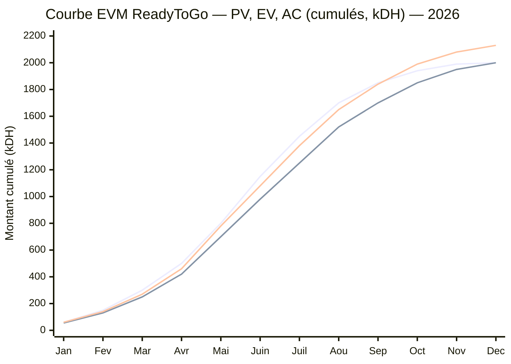

> **Lecture de la courbe :** la ligne du haut en fin de période est **AC** (coût réel, qui dépasse), la ligne médiane **PV** (planifié), la ligne **EV** (valeur acquise) reste sous PV jusqu'en fin d'année. EV < PV ⇒ **retard** ; EV < AC ⇒ **surcoût**.

> **Interprétation & actions correctives.**
> - **Mars-juillet (dégradation) :** **SPI tombe à 0,83-0,86** et **CPI à 0,90-0,91**. Causes : retard d'autorisation (P1), retard application (P3), hausse du prix des trottinettes (P2), pannes en test (P5), incident cyber (P7). Le point de contrôle de **juin** est le plus critique (SV = −170 000, CV = −100 000) et prévoit un dépassement (EAC 2,20 M > BAC).
> - **Décision (juin-juillet) :** livrer un **MVP** (P3), **négocier/arbitrer** les coûts (P2), **rééquilibrer la charge** (P4), **mobiliser la réserve pour risques**.
> - **Août-décembre (redressement) :** **SPI remonte de 0,89 à 1,00** (calendrier rattrapé) ; **CPI se stabilise à 0,94** (le surcoût ~130 000 DH subsiste mais est maîtrisé). Le projet **finit dans les délais** avec un **dépassement de coût de 6,5 %**, financé par la réserve.
>
> Cette trajectoire illustre une **période SPI < 1 et CPI < 1** suivie de l'**effet des mesures correctives** — exactement le comportement attendu d'un pilotage EVM efficace.

## 8.3 Burndown (application mobile)

Backlog initial : **120 points**, 8 sprints de 2 semaines. La courbe réelle reste **au-dessus** de l'idéale (retard P3) ; un **recentrage MVP** solde les 8 derniers points en reportant des fonctions secondaires à la phase 2.

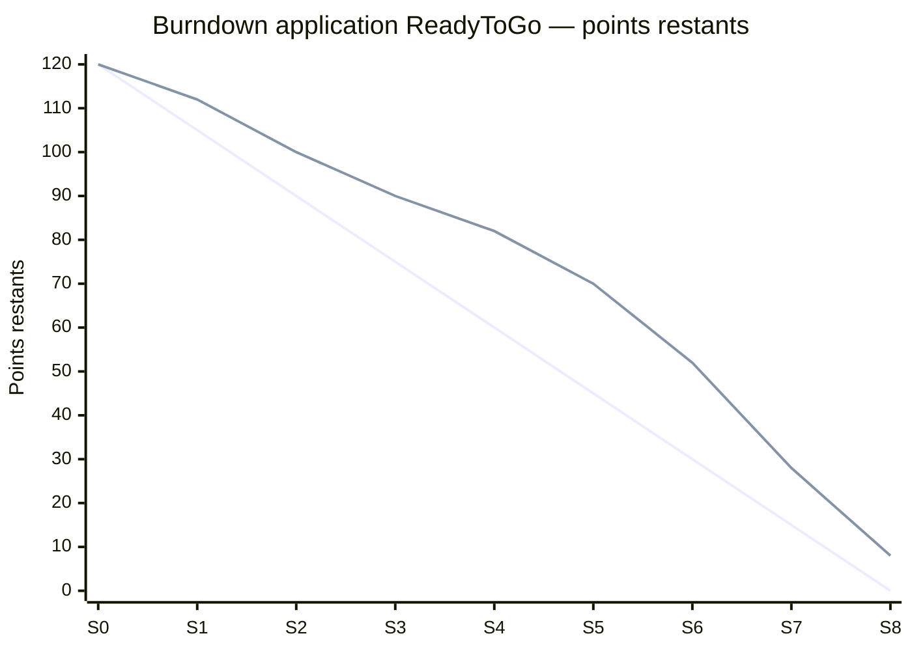

> **Interprétation :** la ligne droite est le **travail idéal restant** ; la ligne au-dessus est le **travail réel restant**. L'écart se creuse aux sprints S2-S6 (intégration paiement/GPS, Problème 3), puis se résorbe. Les **8 points résiduels** en S8 correspondent aux fonctions secondaires **reportées** (décision MVP), assumée et tracée.

## 8.4 Gestion des changements

Toute modification de périmètre, coût ou délai suit un **processus formel** : demande → analyse d'impact → décision du comité → mise à jour des référentiels.

**Modèle de demande de changement (exemple : Problème 10) :**

| Référence | Demandeur | Changement | Justification | Impact coût | Impact délai | Impact qualité | Décision | Approbateur |
|---|---|---|---|---|---|---|---|---|
| DC-001 | Partie prenante | Ajouter une zone près de la gare | Demande de desserte | + ~150 000 DH (bornes + trottinettes) | +4-6 sem | Risque de dérive du périmètre | **Reporté en phase 2** | Comité de pilotage |
| DC-002 | M2 | Recentrer l'app sur un MVP | Retard d'intégration (P3) | +25 000 DH (prestataire) | Neutralise le retard | Fonctions secondaires reportées | **Approuvé** | M1 |
| DC-003 | M4 | Mobiliser la réserve pour risques | Surcoût trottinettes (P2) | +72 000 DH (réserve) | 0 | Qualité préservée | **Approuvé** | Comité de pilotage |

> *Interprétation :* le processus protège le projet de la **dérive de périmètre** (DC-001 reporté) tout en autorisant les adaptations utiles (DC-002, DC-003). Chaque décision est tracée et répercutée sur le planning, le budget et l'EVM.

---

# 9. Livraison du projet *(Étape 7)*

## 9.1 Vérification des livrables

| Livrable | Responsable | Critère d'acceptation | Méthode de vérification | Résultat | Réserve | Validateur |
|---|---|---|---|---|---|---|
| Trottinettes (flotte) | M3 | Conformité, disponibilité ≥ 90 % | Contrôle échantillon + back-office | ✅ Conforme | Suivi 12 unités réparées (P5) | M4 |
| Bornes | M3 | 12 opérationnelles | PV d'installation | ✅ Conforme | — | M1 |
| Application | M2 | Parcours complet fonctionnel | Recette technique | ✅ Conforme (MVP) | Fonctions secondaires en phase 2 (P3) | M1 |
| GPS & verrouillage | M2 | Localisation + verrouillage OK | Tests terrain | ✅ Conforme | — | M3 |
| Paiement | M2 | Transaction test réussie | Test de bout en bout | ✅ Conforme | — | M4 |
| Sécurité (cyber) | M2 | Pentest sans faille bloquante | Test d'intrusion | ✅ Conforme après correction (P7) | Surveillance continue | M1 |
| Protection des données | M2 | Chiffrement + minimisation | Revue de conformité | ✅ Conforme | — | M1 |
| Formation | M3 | Évaluation réussie | Grille d'évaluation | ✅ Conforme | — | M1 |
| Maintenance | M3 | Procédures testées, stock pièces | Simulation d'intervention | ✅ Conforme | — | M1 |
| Documentation | M2 | Complète et à jour | Revue documentaire | ✅ Conforme | Mise à jour continue | M1 |
| Support client | M5 | Hotline + FAQ actives | Test d'appel | ✅ Conforme | Renfort en cas de pic | M1 |
| Tableau de bord | M4 | KPI alimentés | Contrôle des données | ✅ Conforme | — | M1 |

> *Interprétation :* tous les livrables sont **conformes**, plusieurs avec des **réserves** (12 trottinettes réparées, fonctions app reportées, surveillance cybersécurité). Les réserves proviennent directement des problèmes simulés (§7) et sont levées ou suivies selon le processus ci-dessous.

## 9.2 Validation

Le processus de recette est séquentiel : **(1)** tests internes → **(2)** tests techniques → **(3)** tests de sécurité → **(4)** tests utilisateurs → **(5)** correction des anomalies → **(6)** **recette provisoire** (avec réserves) → **(7)** levée des réserves → **(8)** **recette définitive** → **(9)** signature du procès-verbal.

**Modèle de procès-verbal de recette (extrait) :**

> **PROCÈS-VERBAL DE RECETTE — ReadyToGo (pilote)**
> - **Objet :** réception du service pilote (flotte, bornes, application, paiement, GPS, sécurité).
> - **Date :** 30/10/2026 · **Lieu :** Tanger.
> - **Participants :** chef de projet (M1), responsables M2-M5, sponsor.
> - **Type de recette :** ☐ provisoire ☒ définitive.
> - **Réserves :** R1 — surveillance des 12 unités réparées (P5) ; R2 — fonctions app secondaires reportées en phase 2 (P3) ; R3 — surveillance cybersécurité continue (P7).
> - **Décision :** ☒ Accepté avec réserves à lever avant le 30/11/2026.
> - **Signatures :** Sponsor _______ · Chef de projet _______ · Responsables _______.

> *Interprétation :* la **recette avec réserves** est la situation réaliste d'un projet ayant rencontré des aléas : le service est mis en exploitation, mais des points restent sous surveillance avec une échéance de levée.

## 9.3 Transfert vers l'exploitation

| Élément transféré | Émetteur | Destinataire | Date | Condition | Preuve | Statut |
|---|---|---|---|---|---|---|
| Documents & procédures | M2/M3 | Exploitation | 30/10/2026 | À jour | Dépôt documentaire | ✅ Transféré |
| Accès (systèmes, back-office) | M2 | Exploitation | 30/10/2026 | Droits restreints | Journal des accès | ✅ Transféré |
| Formation | M3 | Équipe locale | 17/07/2026 | Évaluation réussie | Attestations | ✅ Transféré |
| Maintenance | M3 | Équipe maintenance | 30/10/2026 | Procédures testées | Fiches d'intervention | ✅ Transféré |
| Stock de pièces | M3 | Exploitation | 30/10/2026 | Inventaire validé | Bon d'inventaire | ✅ Transféré |
| Contrats (fournisseurs, paiement) | M4 | Exploitation | 30/10/2026 | SLA actifs | Contrats signés | ✅ Transféré |
| Assistance après lancement | M5 | Support client | 01/10/2026 | Hotline active | Journal support | ✅ Transféré |
| Responsabilités après transfert | M1 | Exploitation | 30/10/2026 | RACI d'exploitation | RACI signé | ✅ Transféré |

> *Interprétation :* le transfert est **conditionnel** (documents à jour, SLA actifs, formation validée) et **traçable** (preuves). La responsabilité bascule vers l'exploitation, l'équipe projet restant en appui pendant la période de garantie.

## 9.4 Retours d'expérience simulés

> 🟡 **Simulation pédagogique.** Les éléments ci-dessous sont des retours d'expérience **simulés** issus du scénario.

| Événement simulé | Réussite | Difficulté | Cause | Leçon apprise | Recommandation |
|---|---|---|---|---|---|
| Autorisations (P1) | Obtenues | Retard 3 sem | Dossier incomplet | Anticiper l'administratif | Démarrer les autorisations dès le cadrage |
| Achats (P2) | Qualité préservée | Surcoût 8 % | Composants/transport | Sécuriser les prix | Clauses de prix + réserve |
| Application (P3) | MVP livré | Retard 2 sem | Complexité intégration | Découper en MVP | Tester à chaque sprint |
| Tests flotte (P5) | Défauts détectés | Dispo. 92 % | Défauts fournisseur | Recette stricte | SLA & recette à la réception |
| Stationnement (P6) | Corrigé | Plaintes riverains | Comportement | Contraindre + éduquer | Géofencing dès le lancement |
| Cybersécurité (P7) | Faille corrigée | Lancement décalé | Vulnérabilité | *Security by design* | Pentest avant mise en service |
| Adoption (P8) | Progression | Sous cible | Emplacements/notoriété | Ne pas surestimer l'usage | Renforcer les équipes aux pics, activer la demande |

> *Interprétation :* les RETEX confirment que les **quatre problèmes structurants** (autorisations, coûts, application, pannes) sont les plus riches d'enseignements, car ils touchent simultanément délai, coût, qualité et charge. Ces leçons alimentent la préparation des phases 2 à 4.

---

# 10. Analyse économique

## 10.1 Budget détaillé (3 scénarios)

Le budget est construit **de bas en haut** (bottom-up) à partir des postes réels, en trois scénarios : **minimal**, **probable**, **maximal**. Montants en DH.

| Poste | Détail | Minimal | Probable | Maximal |
|---|---|--:|--:|--:|
| **CAPEX — Investissement** | | | | |
| Trottinettes (150) | 5 000 / 6 000 / 7 000 DH l'unité | 750 000 | 900 000 | 1 050 000 |
| Bornes stationnement/recharge (12) | 15 000 / 20 000 / 25 000 DH | 180 000 | 240 000 | 300 000 |
| Kits IoT (GPS + SIM + serrure + QR) | 600 / 800 / 1 000 DH × 150 | 90 000 | 120 000 | 150 000 |
| Application mobile + back-office | Développement | 150 000 | 200 000 | 300 000 |
| Intégration paiement | Passerelle + certification | 20 000 | 30 000 | 45 000 |
| Cybersécurité | Audit + pentest initial | 20 000 | 30 000 | 50 000 |
| Signalétique + habillage | Branding trottinettes/bornes | 15 000 | 25 000 | 40 000 |
| **Sous-total CAPEX** | | **1 225 000** | **1 545 000** | **1 935 000** |
| **OPEX — Fonctionnement (6 mois pilote)** | | | | |
| Équipe locale (6 pers.) | 4 000 / 5 000 / 6 000 DH × 6 × 6 mois | 144 000 | 180 000 | 216 000 |
| Recharge électrique | 6 mois | 24 000 | 30 000 | 40 000 |
| Connectivité SIM (data) | 150 cartes × 6 mois | 12 000 | 18 000 | 24 000 |
| Maintenance + pièces de rechange | 6 mois | 40 000 | 55 000 | 80 000 |
| Assurances (RC, flotte, cyber) | 6 mois | 30 000 | 40 000 | 55 000 |
| Autorisations + frais administratifs | Domaine public, juridique | 15 000 | 25 000 | 40 000 |
| Recrutement + formation | Ponctuel | 12 000 | 20 000 | 30 000 |
| Marketing + lancement | Campagnes, offres | 50 000 | 75 000 | 120 000 |
| Support client | Outil + partiel | 8 000 | 12 000 | 20 000 |
| **Sous-total OPEX** | | **335 000** | **455 000** | **625 000** |
| **Base de coût (CAPEX + OPEX)** | | **1 560 000** | **2 000 000** | **2 560 000** |
| Réserve pour risques + imprévus | 8 % de la base | 124 800 | 160 000 | 204 800 |
| **TOTAL** | | **≈ 1 684 800** | **≈ 2 160 000** | **≈ 2 764 800** |

> *Interprétation :* le poste **trottinettes** représente à lui seul ~42-48 % du CAPEX ; c'est le levier de coût le plus sensible (d'où l'impact du Problème 2). La **base de coût du scénario probable (2 000 000 DH)** sert de **BAC** à la simulation EVM (§8.2).

### Comparaison avec la fourchette initiale (1,5 à 2 M DH)

| Scénario | Total | Position vs 1,5-2 M DH | Écart vs plafond 2 M |
|---|--:|---|--:|
| Minimal | ≈ 1,68 M | **Dans la fourchette** | −16 % |
| Probable | ≈ 2,16 M | **Légèrement au-dessus** | **+8 %** |
| Maximal | ≈ 2,76 M | **Nettement au-dessus** | +38 % |

> **Explication des écarts.** La fourchette initiale de 1,5-2 M DH correspond, en pratique, au **CAPEX + une exploitation pilote allégée**, sans provision complète pour aléas. Le chiffrage bottom-up ajoute des **OPEX réalistes sur 6 mois** et une **réserve pour risques**, ce qui porte le scénario probable à ~2,16 M DH (+8 % au-dessus du plafond). Pour **rester dans l'enveloppe** de 2 M DH, plusieurs leviers sont possibles : (1) réduire la flotte pilote à ~130 trottinettes ; (2) négocier le prix unitaire (achats groupés, clause de prix) ; (3) étaler le marketing sur la phase 2 ; (4) raccourcir la fenêtre d'OPEX financée à l'avance. Ces arbitrages sont documentés et n'affectent ni la qualité ni la sécurité.

> 🔵 **Décision — Référentiel budgétaire :** retenir le **scénario probable (2,0 M DH de base + 0,16 M de réserve)** comme référence, avec suivi EVM mensuel et seuil d'alerte CPI < 0,90.

## 10.2 Tarification et revenus

**Grille tarifaire envisagée :**

| Formule | Prix | Commentaire |
|---|--:|---|
| Déverrouillage | 3 DH | Frais fixe par trajet |
| Prix à la minute | 1 DH/min | Facturation à l'usage |
| Trajet moyen (10 min) | ≈ 13 DH | 3 + (10 × 1) |
| Pass journée | 60 DH | Touristes, jours de match |
| Pass semaine | 300 DH | Visiteurs 2030 |
| Abonnement mensuel | 150 DH | Habitants, étudiants |

**Sources de revenus envisagées :** paiement à la minute ; pass journée ; pass semaine ; abonnement mensuel ; publicité sur les trottinettes ; publicité sur les bornes ; sponsoring ; partenariats hôtels (commission sur pass) ; commissions sur les pass ; soutien institutionnel éventuel *(à négocier, non acquis)*.

### Rentabilité de l'abonnement mensuel (150 DH)

Coût variable estimé par trajet (énergie, part de maintenance, redistribution) ≈ **2 DH**. À 150 DH/mois, le point d'équilibre de l'abonnement est **150 ÷ 2 = 75 trajets/mois** (~2,5 trajets/jour). Un usager régulier (2 trajets/jour ouvré ≈ 44/mois) reste rentable ; un usage intensif (4+ trajets/jour) devient déficitaire.

> 🔵 **Décision — Encadrement de l'abonnement :** pour éviter les abus tout en restant attractif, l'abonnement 150 DH inclut **2 trajets/jour de moins de 20 min** ; au-delà, tarif réduit **0,5 DH/min**. Alternatives : formule « éco » 90 DH (1 trajet/jour) et « premium » 220 DH (usage large). Une **durée maximale de 20 min/trajet** et une **politique d'usage raisonnable** encadrent l'offre.

### Analyse du seuil de rentabilité

**Coût mensuel d'exploitation (steady state)** ≈ **113 000 DH** = OPEX récurrent (~70 000 DH/mois) + amortissement CAPEX (~43 000 DH/mois, sur 36 mois). **Revenu moyen mixte par trajet** ≈ **8 DH** (mélange usage/pass/abonnements avec remises).

**Point mort :** 113 000 ÷ (150 trottinettes × 30 jours × 8 DH) = **≈ 3,1 trajets par trottinette et par jour.**

| Scénario de fréquentation | Trajets/trottinette/jour | Revenu mensuel | Coût mensuel | Résultat mensuel |
|---|:--:|--:|--:|--:|
| **Faible** | 3,0 | 108 000 DH | 113 000 DH | **−5 000 DH** (déficit) |
| **Probable** | 5,0 | 180 000 DH | 113 000 DH | **+67 000 DH** |
| **Élevée** | 8,0 | 288 000 DH | 113 000 DH | **+175 000 DH** |

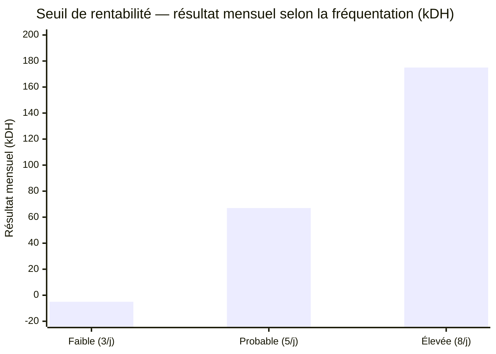

> **Interprétation :** la rentabilité opérationnelle est atteinte à partir de **~3,1 trajets/trottinette/jour**. Le scénario **faible est légèrement déficitaire**, le **probable** et l'**élevé** dégagent une marge. **Aucune rentabilité n'est promise** : elle dépend de l'adoption réelle — précisément le point mis à l'épreuve par le **Problème 8** (adoption sous cible le premier mois), qui place temporairement le service **au niveau ou sous le point mort** et justifie les actions d'activation de la demande. Le seuil de 3,1 est aussi le **seuil d'alerte du KPI K4** (§8.1).

> 🟠 **Hypothèses de travail à valider :** prix des modes concurrents, revenu moyen par trajet (8 DH), coût variable par trajet (2 DH), durée d'amortissement (36 mois) et fréquentation. À confirmer par relevés terrain et données d'exploitation.

---

# 11. Qualité, sécurité et durabilité

## 11.1 Plan d'assurance qualité

| Domaine | Exigence | Contrôle | Fréquence | Responsable |
|---|---|---|---|---|
| Flotte | État mécanique et batterie | Contrôle quotidien + inspection | Quotidienne | M3 |
| Application | Absence d'anomalie bloquante | Recette + monitoring | Continue | M2 |
| Sécurité usagers | Limitation de vitesse, tutoriel | Paramétrage + audit | Mensuelle | M3 |
| Données | Chiffrement, minimisation | Revue de conformité | Trimestrielle | M2 |
| Stationnement | Zones autorisées respectées | Géofencing + relevés | Continue | M5 |
| Satisfaction | Note ≥ 4/5 | Enquête in-app | Mensuelle | M5 |

## 11.2 Sécurité et exploitation

- **Maintenance préventive et corrective :** planning d'entretien, stock de pièces, délai de remise en service ≤ 48 h.
- **Contrôles quotidiens :** freins, pneus, batterie, verrouillage.
- **Limitation de vitesse** et **zones à vitesse réduite** (centre-ville, corniche fréquentée).
- **Géofencing** : circulation et stationnement cantonnés aux zones autorisées ; impossibilité de terminer un trajet hors zone.
- **Stationnement autorisé** matérialisé (bornes, marquage, signalétique).
- **Procédure en cas d'accident :** assistance, déclaration (formulaire d'incident, annexe), analyse, mesures.
- **Protection des données & cybersécurité :** chiffrement, MFA, minimisation, pentest avant mise en service (cf. Problème 7), plan de réponse aux incidents.
- **Accessibilité de l'application :** interface simple, contrastes, parcours guidé.
- **Signalétique multilingue :** français, arabe, anglais, espagnol (utile pour 2030).

## 11.3 Durabilité — analyse nuancée

> ⚠️ Les trottinettes **ne sont pas automatiquement écologiques**. Leur bénéfice environnemental **dépend de conditions** à vérifier.

| Facteur | Condition d'un bénéfice réel | Levier ReadyToGo |
|---|---|---|
| **Report modal** | Remplacer effectivement des trajets en voiture/taxi (et non la marche/vélo) | Cibler les trajets courts motorisés, mesurer via enquêtes |
| **Durée de vie** | Trottinettes robustes, longue durée d'usage | Modèle « usage intensif », maintenance préventive |
| **Recharge** | Électricité peu carbonée, recharge optimisée | Recharge nocturne, sobriété, option solaire *(à valider)* |
| **Maintenance** | Réparabilité, pièces disponibles | Stock de pièces, réparation plutôt que remplacement |
| **Recyclage des batteries** | Filière de collecte et recyclage | Contrat de reprise fournisseur *(à négocier)* |

> *Interprétation :* le bénéfice environnemental est **potentiel et conditionnel**. ReadyToGo s'engage à **mesurer** le report modal réel et à **maximiser** la durée de vie et le recyclage, sans surestimer l'impact écologique.

---

# 12. Identité de ReadyToGo

- **Couleur principale :** **orange** (#F57C00) — dynamisme, chaleur, visibilité.
- **Couleur secondaire :** **bleu détroit** (#0B5394) — référence au détroit de Gibraltar, confiance.
- **Couleurs d'appui :** blanc, gris clair (lisibilité, modernité).
- **Symbole :** une **roue stylisée associée à un éclair** (mobilité + énergie électrique).
- **Valeurs :** rapidité, simplicité, sécurité, accessibilité, mobilité responsable.

**Propositions de slogan :**

| # | Slogan | Force | Limite |
|---|---|---|---|
| S1 | « ReadyToGo — plus vite que le trafic » | Bénéfice clair (rapidité) | Un peu agressif vis-à-vis des autres modes |
| S2 | « ReadyToGo — votre trajet court, en un clic » | Simplicité, usage | Moins évocateur de la ville |
| S3 | « ReadyToGo — Tanger à portée de roue » | Ancrage local + mobilité | Jeu de mots à expliciter |

> 🔵 **Décision — Slogan retenu : S3 « Tanger à portée de roue ».** Il combine **ancrage territorial** (Tanger, atout pour 2030 et l'acceptabilité locale), **promesse de proximité/rapidité** cohérente avec le positionnement « trajets courts », et une **tonalité positive et complémentaire** (et non frontale vis-à-vis des transports publics), contrairement à S1. S2 reste pertinent comme accroche fonctionnelle secondaire dans l'application.

---

# 13. Recommandations

| # | Recommandation | Priorité | Impact | Urgence | Responsable | Échéance |
|---|---|:--:|:--:|:--:|---|---|
| R1 | Sécuriser les autorisations dès le cadrage (dossier complet) | Haute | Élevé | Haute | M1 | Avant J3 |
| R2 | Contractualiser des SLA fournisseurs (prix, délai, qualité) | Haute | Élevé | Haute | M4 | Avant J4 |
| R3 | Livrer l'application en MVP et itérer par sprints | Haute | Élevé | Moyenne | M2 | Avant J5 |
| R4 | Activer le géofencing bloquant dès le lancement | Haute | Élevé | Haute | M2/M5 | Avant J10 |
| R5 | Maintenir une réserve pour risques ≥ 8 % du budget | Haute | Élevé | Moyenne | M4 | Continue |
| R6 | Suivre l'EVM mensuellement (alerte CPI < 0,90 / SPI < 0,90) | Moyenne | Moyen | Moyenne | M4 | Mensuelle |
| R7 | Encadrer l'abonnement (usage raisonnable, plafond, durée) | Moyenne | Moyen | Moyenne | M4/M5 | Avant lancement |
| R8 | Rendre l'onboarding sécurité obligatoire dans l'app | Moyenne | Moyen | Moyenne | M3 | Avant J10 |
| R9 | Mesurer le report modal réel avant tout argument écologique | Moyenne | Moyen | Basse | M5 | Pilote + 3 mois |
| R10 | Décider l'extension sur la base des KPI du pilote (J12) | Haute | Élevé | Basse | Sponsor | 31/03/2027 |

> *Interprétation :* les recommandations à **priorité haute** (R1, R2, R3, R4, R5, R10) adressent les causes des problèmes les plus coûteux (autorisations, coûts, application, stationnement, budget) et conditionnent la réussite ainsi que la décision d'extension.

---

# 14. Conclusion générale

**Réponse à la problématique.** Un service de trottinettes électriques en libre-service **peut être planifié, organisé et piloté** à Tanger de façon rigoureuse : ce rapport en a décliné les sept étapes, du cadrage à la livraison, avec des outils de gestion de projet cohérents et chiffrés.

**Faisabilité.** ReadyToGo est **faisable sous conditions**. Techniquement, la solution (flotte + bornes + application + IoT) est maîtrisable via une méthode hybride. Économiquement, le budget réaliste (≈ 2,16 M DH) dépasse légèrement l'enveloppe initiale mais reste maîtrisable avec des arbitrages ; la rentabilité opérationnelle est atteignable **au-delà de ~3,1 trajets/trottinette/jour**, sans garantie — elle **dépend de l'adoption**.

**Avantages.** Gain de temps sur les trajets courts, complémentarité avec les transports publics, atout pour l'accueil des visiteurs de 2030, montée en charge progressive et maîtrisée.

**Limites.** Dépendance aux autorisations et aux fournisseurs, sensibilité à l'adoption, enjeux de sécurité et d'acceptabilité (stationnement), bénéfice environnemental conditionnel.

**Conditions de réussite.** Obtenir les autorisations tôt, sécuriser les coûts, livrer un MVP fiable, contraindre le stationnement (géofencing), intégrer la cybersécurité dès la conception, et piloter par KPI/EVM avec une réserve suffisante.

**Prochaines décisions.** Évaluation du pilote (J12, mars 2027) puis **go/no-go de l'extension** (J13). En cas de succès, déploiement progressif jusqu'au dispositif renforcé de **2030**.

**Ouverture.** Au-delà de l'événement 2030, ReadyToGo peut s'inscrire durablement dans l'écosystème de mobilité de Tanger, à condition de démontrer, données à l'appui, son utilité, sa soutenabilité et son bénéfice environnemental réel. La leçon centrale de ce projet reste que **la réussite ne tient pas à l'absence de problèmes, mais à la capacité de l'équipe à les détecter, décider et corriger**.

---

# 15. Bibliographie

> **Règle appliquée :** aucune source n'est inventée. Les références méthodologiques ci-dessous sont des ouvrages/normes **réels et vérifiables**. Les éléments propres à Tanger et à 2030 sont signalés comme **données à vérifier auprès des sources officielles** (aucune convention ni autorisation n'est présentée comme acquise).

### 15.1 Références méthodologiques (gestion de projet) — vérifiables

1. **Project Management Institute (PMI).** *A Guide to the Project Management Body of Knowledge (PMBOK® Guide)*, 7ᵉ édition, 2021. — Fondements (parties prenantes, planification, valeur acquise, risques).
2. **ISO 21502:2020**, *Management de projet, de programme et de portefeuille — Lignes directrices sur le management de projet*. — Processus et gouvernance.
3. **ISO 31000:2018**, *Management du risque — Lignes directrices*. — Méthode d'analyse des risques (§5).
4. **AXELOS.** *Managing Successful Projects with PRINCE2*, 2017. — Jalons, produits, contrôle par étapes.
5. **PMI.** *Practice Standard for Earned Value Management*, 2ᵉ édition. — Formules et interprétation EVM (§8.2).
6. **Schwaber K., Sutherland J.** *The Scrum Guide*, 2020. — Sprints et burndown (§8.3).

### 15.2 Références sur la micromobilité — vérifiables

7. **OECD/ITF (International Transport Forum).** *Safe Micromobility*, 2020. — Sécurité et intégration urbaine des trottinettes.
8. **ITDP (Institute for Transportation and Development Policy).** Publications sur la micromobilité partagée et le stationnement. — Bonnes pratiques d'exploitation.

### 15.3 Sources à consulter / données à vérifier (non acquises)

> 🟠 **À vérifier — ne pas citer comme acquis.** Les éléments suivants doivent être confirmés auprès des sources officielles avant toute décision ; ils sont utilisés dans ce rapport comme **hypothèses de travail**.

9. **Commune / Mairie de Tanger** — règles d'occupation du domaine public, zones autorisées. *(Source officielle à consulter ; date de consultation : __/__/____.)*
10. **FRMF / instances Coupe du Monde 2030** — calendrier et exigences liées aux sites. *(À consulter ; date : __/__/____.)*
11. **Fabricants de trottinettes et de bornes** — fiches techniques et prix unitaires. *(Devis à obtenir ; date : __/__/____.)*
12. **Sources réglementaires marocaines** (circulation, protection des données) — cadre applicable. *(À vérifier ; date : __/__/____.)*

> *Interprétation :* les données de marché (prix des modes concurrents, coûts unitaires, fréquentation) mobilisées dans ce rapport sont des **estimations** ou des **hypothèses de travail à valider** par relevés terrain et devis. Elles sont clairement distinguées des références méthodologiques vérifiables.

---

# 16. Annexes

> La plupart des artefacts demandés figurent **dans le corps du rapport** ; les annexes ci-dessous les recensent et ajoutent les documents complémentaires (charte, organigramme, formulaires, glossaire).

| Annexe | Contenu | Emplacement |
|---|---|---|
| A1 | Charte du projet | Annexe A1 (ci-dessous) |
| A2 | WBS | §3.2 |
| A3 | Planning détaillé | §3.3 |
| A4 | Diagrammes de Gantt | §3.4 |
| A5 | Jalons | §3.5 |
| A6 | Organigramme | Annexe A6 (ci-dessous) |
| A7 | Matrice RACI | §4.5 |
| A8 | Répartition des tâches (5 membres) | §4.3 |
| A9 | Contribution individuelle | §4.7 |
| A10 | Plan de charge | §4.6 |
| A11 | Registre des risques | §5.2 |
| A12 | Matrice probabilité-impact | §5.3 |
| A13 | Plan de communication | §6.2 |
| A14 | Matrice de communication | §6.3 |
| A15 | Tableau de bord KPI | §8.1 |
| A16 | Simulation EVM | §8.2 |
| A17 | Burndown | §8.3 |
| A18 | Budget détaillé (3 scénarios) | §10.1 |
| A19 | Checklist de livraison | §9.1 |
| A20 | Procès-verbal de recette | §9.2 |
| A21 | Formulaire d'incident | Annexe A21 (ci-dessous) |
| A22 | Demande de changement | §8.4 |
| A23 | Glossaire | Liste des sigles + Annexe A23 |
| A24 | Journal des problèmes | §7.1 |

## Annexe A1 — Charte du projet (synthèse)

| Rubrique | Contenu |
|---|---|
| **Projet** | ReadyToGo — service pilote de trottinettes électriques, Tanger |
| **Justification** | Améliorer la mobilité sur les trajets courts ; préparer 2030 |
| **Objectif général** | Déployer un pilote (150 tr., 12 bornes) d'ici le 01/10/2026, budget 2,0 M DH ± 10 %, disponibilité ≥ 90 % |
| **Périmètre** | Corniche + centre-ville (voir §2.4) |
| **Jalons clés** | Autorisations, flotte livrée, fin des tests, lancement, recette (voir §3.5) |
| **Budget de référence** | 2,0 M DH (base) + réserve 8 % |
| **Gouvernance** | Sponsor, chef de projet (M1), comité de pilotage, 5 membres (voir §2.7) |
| **Risques majeurs** | Autorisations (R04), cybersécurité (R09), coûts (R17), adoption (R14) |
| **Critères de réussite** | Délai, budget ± 10 %, disponibilité ≥ 90 %, satisfaction ≥ 4/5, zéro incident grave |

## Annexe A6 — Organigramme projet

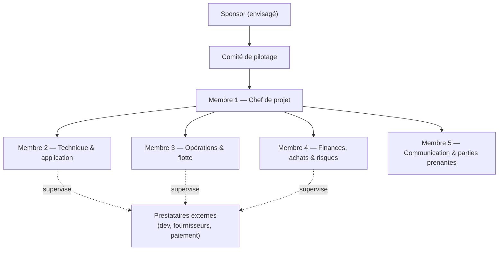

> *Interprétation :* structure fonctionnelle simple : le chef de projet coordonne les quatre responsables de domaine ; les prestataires externes sont toujours supervisés par un membre.

## Annexe A21 — Formulaire d'incident (modèle)

| Champ | Valeur |
|---|---|
| Référence | INC-____ |
| Date / heure | __/__/____ — __:__ |
| Lieu | ____ |
| Type | ☐ Accident ☐ Panne ☐ Vandalisme ☐ Cybersécurité ☐ Autre |
| Description | ____ |
| Personnes concernées | ____ |
| Gravité | ☐ Mineure ☐ Modérée ☐ Grave |
| Actions immédiates | ____ |
| Responsable du suivi | ____ |
| Mesures correctives | ____ |
| Statut | ☐ Ouvert ☐ En cours ☐ Clos |

## Annexe A23 — Glossaire (compléments)

| Terme | Définition |
|---|---|
| **Géofencing** | Délimitation virtuelle de zones où la trottinette peut circuler/stationner. |
| **Micromobilité** | Modes de déplacement légers pour trajets courts (trottinettes, vélos partagés). |
| **MVP** | Version minimale d'un produit livrant l'essentiel de la valeur, à enrichir ensuite. |
| **Point mort** | Niveau d'activité où les recettes couvrent exactement les coûts. |
| **Report modal** | Transfert d'usagers d'un mode de transport vers un autre. |
| **Réserve pour risques** | Provision budgétaire destinée à financer les aléas identifiés. |
| **SLA** | Engagement contractuel de niveau de service (délai, qualité, disponibilité). |

*(Voir aussi la liste des sigles et abréviations en début de rapport.)*

---

# 17. Contrôle final

Vérification systématique des exigences du cahier des charges :

| # | Point de contrôle | Statut | Emplacement |
|---|---|:--:|---|
| 1 | L'ancien nom à supprimer n'apparaît nulle part | ✅ | Vérifié (recherche automatisée) |
| 2 | « ReadyToGo » utilisé partout | ✅ | Ensemble du document |
| 3 | Les 7 étapes sont présentes | ✅ | §2 à §9 |
| 4 | Objectifs SMART | ✅ | §2.3 |
| 5 | Livrables avec critères d'acceptation | ✅ | §2.5, §9.1 |
| 6 | Parties prenantes identifiées | ✅ | §2.6 |
| 7 | Planning (tâches, durées, séquences, responsables) | ✅ | §3.3 |
| 8 | Gantt cohérent avec le planning | ✅ | §3.4 |
| 9 | Jalons présents | ✅ | §3.5 |
| 10 | Toutes les tâches réparties entre les 5 membres | ✅ | §4.3, §4.5 |
| 11 | Contributions = 100 % (≈ 20 %/pers.) | ✅ | §4.7 |
| 12 | Charge équilibrée, surcharges analysées | ✅ | §4.6 |
| 13 | Matrice RACI cohérente (un seul « A »/tâche) | ✅ | §4.5 |
| 14 | Risques avec probabilité, impact, réponse | ✅ | §5.2 |
| 15 | Plan de communication (canaux, messages, supports) | ✅ | §6.2 |
| 16 | Matrice de communication complète | ✅ | §6.3 |
| 17 | 5 KPI principaux | ✅ | §8.1 |
| 18 | EVM : calculs, courbe, interprétation | ✅ | §8.2 |
| 19 | Livrables vérifiés | ✅ | §9.1 |
| 20 | Processus de validation et de transfert expliqué | ✅ | §9.2, §9.3 |
| 21 | RETEX signalés comme simulés | ✅ | §9.4, §7 |
| 22 | Budget cohérent (3 scénarios, comparaison) | ✅ | §10.1 |
| 23 | Hypothèses identifiées | ✅ | Encadrés 🟠 |
| 24 | Sources non inventées | ✅ | §15 |
| 25 | Dates, coûts, responsabilités cohérents | ✅ | Vérifié (BAC 2,0 M ↔ EVM ↔ budget) |
| 26 | Chaque tableau/graphique suivi d'une interprétation | ✅ | Ensemble du document |
| 27 | Simulation des problèmes impactant Gantt/budget/EVM | ✅ | §7 + §3.4, §8.2 |

> **Conclusion du contrôle :** l'ensemble des exigences est satisfait. Les éléments non figés (noms des membres, établissement, filière, enseignant, date de remise) sont explicitement marqués « *[À compléter]* » et les données non vérifiées « *Hypothèse de travail à valider* ».

---

*ReadyToGo — Rapport de projet · Module « Gestion de projets » · 2025-2026*

