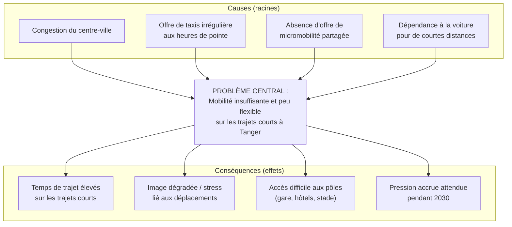
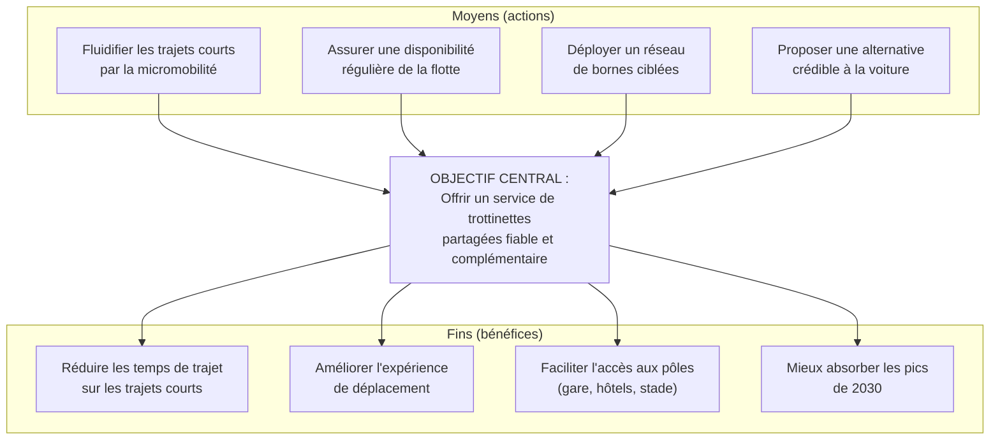
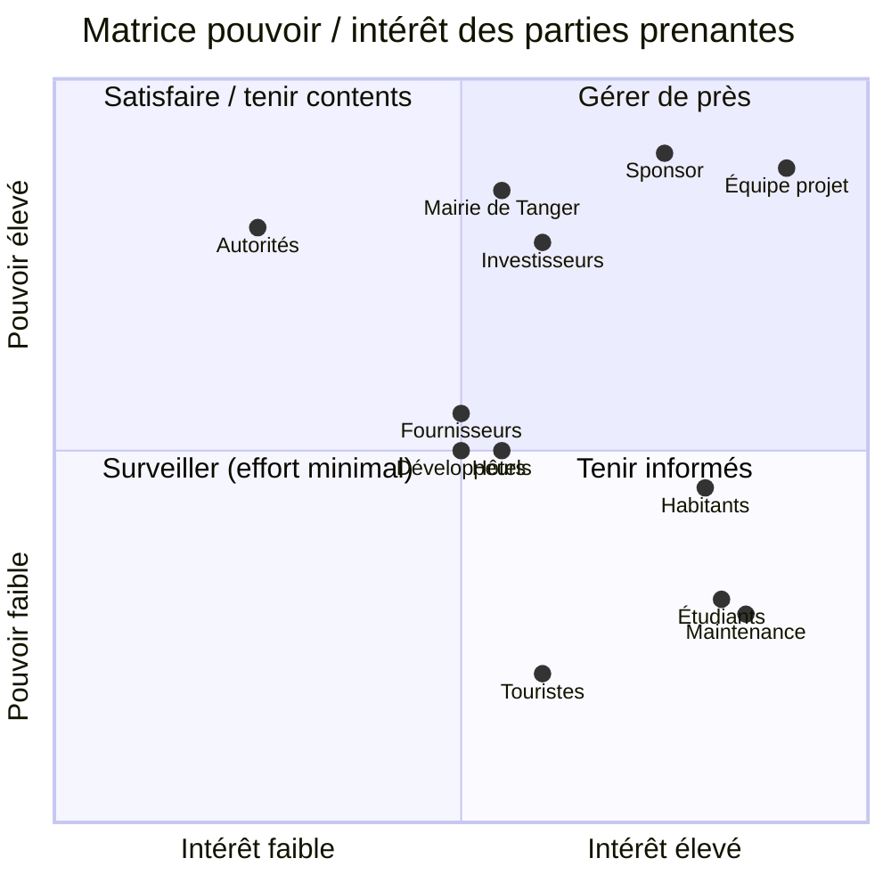
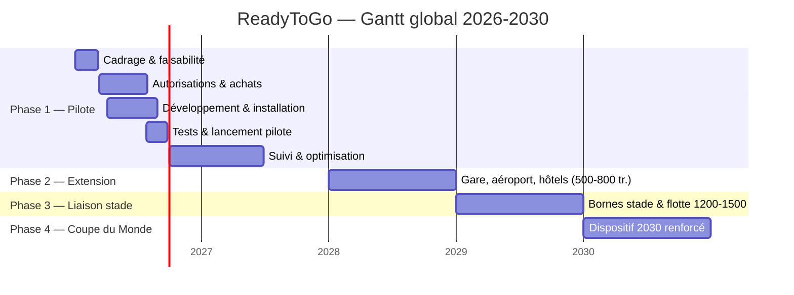
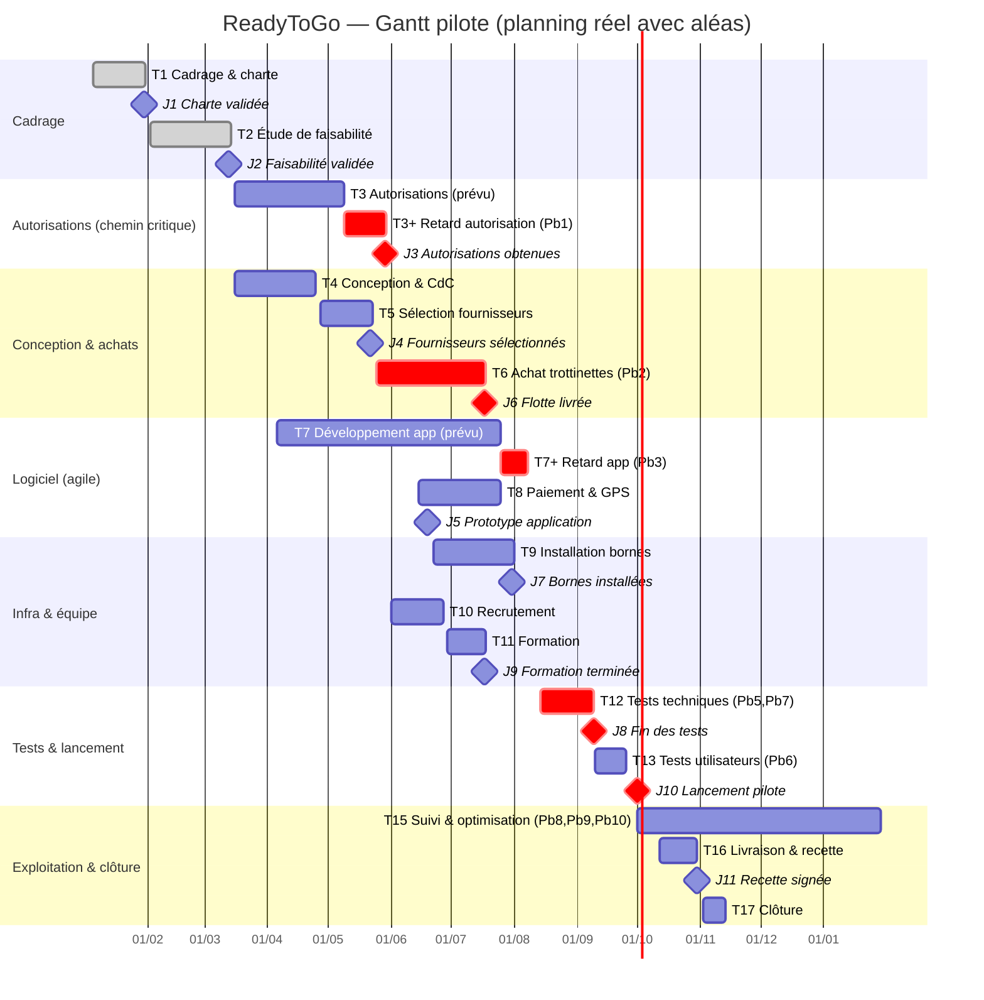

<!--
================================================================================
  ReadyToGo — Rapport de projet
  Module : Gestion de projets — Année universitaire 2025-2026
  Ville : Tanger, Maroc
  Charte graphique : Orange (#F57C00) · Bleu détroit (#0B5394) · Blanc · Gris clair
  Ce document est rédigé en français académique. Les diagrammes utilisent la
  syntaxe Mermaid (rendue nativement sur GitHub et la plupart des visionneuses
  Markdown). Il peut être exporté en Word ou PDF sans perte de structure.
================================================================================
-->

# ReadyToGo
## Service de trottinettes électriques en libre-service à Tanger
### Rapport de projet — Module « Gestion de projets »

**Mobilité urbaine & Coupe du Monde 2030**

---

## Page de garde

| | |
|---|---|
| **Nom du projet** | ReadyToGo |
| **Module** | Gestion de projets |
| **Ville** | Tanger, Maroc |
| **Établissement** | *[À compléter]* |
| **Filière** | *[À compléter]* |
| **Enseignant** | *[À compléter]* |
| **Année universitaire** | 2025-2026 |
| **Date de remise** | *[À compléter]* |

**Équipe projet (5 membres) :**

| Rôle | Membre |
|---|---|
| Membre 1 — Chef de projet & coordination | *[Nom et prénom à compléter]* |
| Membre 2 — Responsable technique & application | *[Nom et prénom à compléter]* |
| Membre 3 — Responsable opérations, flotte & logistique | *[Nom et prénom à compléter]* |
| Membre 4 — Responsable finances, achats & risques | *[Nom et prénom à compléter]* |
| Membre 5 — Responsable communication & parties prenantes | *[Nom et prénom à compléter]* |

> **En-tête recommandé pour l'export Word/PDF :** « ReadyToGo — Rapport de projet » · pieds de page avec numérotation. Charte : orange, bleu détroit, blanc, gris clair.

---

## Remerciements

Nous adressons nos remerciements à notre enseignant du module « Gestion de projets » pour son encadrement méthodologique, ainsi qu'à l'ensemble des personnes qui ont accepté d'échanger avec nous sur les enjeux de mobilité urbaine à Tanger. Nous remercions également notre établissement pour la mise à disposition des ressources documentaires ayant permis de mener à bien ce travail collectif.

> *Section facultative — à personnaliser par l'équipe.*

---

## Résumé exécutif

**ReadyToGo** est un projet de micromobilité visant à déployer à Tanger un service de trottinettes électriques en libre-service. Il répond à un besoin concret : la congestion du centre-ville, la difficulté d'accès rapide à certaines zones stratégiques et l'afflux attendu de visiteurs à l'horizon de la **Coupe du Monde 2030**. ReadyToGo se positionne comme une **solution complémentaire** aux transports existants (bus, taxi, voiture, marche) pour les trajets courts, et non comme un substitut aux transports publics.

Le présent rapport traite le projet sous l'angle de la **gestion de projet**, conformément aux sept étapes attendues : définition, planification, organisation du travail, gestion des risques, plan de communication, suivi & indicateurs, et livraison. Il mobilise les outils standards de la discipline : arbre à problèmes et à objectifs, SWOT, PESTEL, objectifs SMART, WBS, diagramme de Gantt, matrice RACI, plan de charge, registre des risques, matrice probabilité-impact, KPI et **simulation de la valeur acquise (EVM)**.

Le déploiement est **progressif et jalonné** : phase pilote 2026-2027 (150 trottinettes, 12 bornes sur la corniche et le centre-ville), extension en 2028 (gare, aéroport, quartiers hôteliers), liaison vers le Grand Stade en 2029, puis dispositif renforcé pour 2030.

Sur le plan économique, l'analyse budgétaire détaillée (bottom-up) produit trois scénarios : **minimal ≈ 1,68 M DH**, **probable ≈ 2,16 M DH**, **maximal ≈ 2,76 M DH**. Le scénario probable dépasse légèrement (~8 %) la fourchette initiale de 1,5 à 2 M DH : cet écart est analysé et des leviers d'ajustement sont proposés. L'analyse du seuil de rentabilité situe le point mort opérationnel autour de **3,1 trajets par trottinette et par jour** ; le scénario de fréquentation « faible » est déficitaire, tandis que les scénarios « probable » et « élevé » dégagent une marge. Aucune rentabilité n'est promise : elle est **conditionnée** à l'adoption réelle du service.

Fait distinctif de ce rapport, une **simulation pédagogique des difficultés** est intégrée : dix problèmes réalistes (retard d'autorisation, hausse du prix des trottinettes, retard de l'application, surcharge d'un membre, pannes en test, stationnement non conforme, incident de cybersécurité, adoption faible, accident mineur, demande de changement de périmètre) surviennent effectivement dans le scénario et **modifient réellement** le planning, le budget, le plan de charge, les KPI et la courbe EVM (périodes avec SPI < 1 et CPI < 1), avant redressement grâce aux actions correctives.

**Conclusion :** ReadyToGo est **faisable sous conditions** (obtention des autorisations, maîtrise des coûts, adoption suffisante, qualité et sécurité). La réussite d'un projet ne réside pas dans l'absence de problèmes, mais dans la capacité de l'équipe à les détecter, décider et corriger rapidement.

---

## Liste des sigles et abréviations

| Sigle | Signification |
|---|---|
| **AC** | *Actual Cost* — Coût réel (EVM) |
| **BAC** | *Budget At Completion* — Budget à l'achèvement |
| **BRT** | *Bus Rapid Transit* — Bus à haut niveau de service |
| **CAPEX** | *Capital Expenditure* — Dépenses d'investissement |
| **CPI** | *Cost Performance Index* — Indice de performance des coûts |
| **CV** | *Cost Variance* — Écart de coût (EVM) |
| **DH** | Dirham marocain |
| **EAC** | *Estimate At Completion* — Coût final estimé |
| **ETC** | *Estimate To Complete* — Coût restant estimé |
| **EV** | *Earned Value* — Valeur acquise (EVM) |
| **EVM** | *Earned Value Management* — Gestion par la valeur acquise |
| **FRMF** | Fédération Royale Marocaine de Football |
| **GPS** | *Global Positioning System* — Géolocalisation |
| **IoT** | *Internet of Things* — Objets connectés |
| **KPI** | *Key Performance Indicator* — Indicateur clé de performance |
| **MVP** | *Minimum Viable Product* — Produit minimum viable |
| **OPEX** | *Operational Expenditure* — Dépenses de fonctionnement |
| **PESTEL** | Politique, Économique, Social, Technologique, Environnemental, Légal |
| **PMB** | *Performance Measurement Baseline* — Référentiel de mesure |
| **PV** | *Planned Value* — Valeur planifiée (EVM) |
| **PV (doc.)** | Procès-verbal (contexte livraison/recette) |
| **QR** | *Quick Response* (code) |
| **RACI** | Réalise, Approuve, Consulté, Informé |
| **RC** | Responsabilité Civile (assurance) |
| **RETEX** | Retour d'expérience |
| **SLA** | *Service Level Agreement* — Niveau de service contractuel |
| **SMART** | Spécifique, Mesurable, Atteignable, Réaliste, Temporellement défini |
| **SPI** | *Schedule Performance Index* — Indice de performance des délais |
| **SV** | *Schedule Variance* — Écart de délai (EVM) |
| **SWOT** | Forces, Faiblesses, Opportunités, Menaces |
| **VAC** | *Variance At Completion* — Écart final estimé |
| **WBS** | *Work Breakdown Structure* — Structure de découpage du projet |

> **Note terminologique :** dans ce rapport, « PV » désigne la *valeur planifiée* dans les sections EVM, et « procès-verbal » dans la section Livraison. Le contexte lève l'ambiguïté.

---

## Sommaire détaillé

1. **Introduction générale**
2. **Définition du projet**
   - 2.1 Présentation de ReadyToGo (concept, problème, solution, valeur, utilisateurs, zones, positionnement)
   - 2.2 Diagnostic (besoin, arbre à problèmes, arbre des objectifs, SWOT, PESTEL, justification)
   - 2.3 Objectifs SMART (général + spécifiques + tableau d'indicateurs)
   - 2.4 Périmètre (inclus, exclus, contraintes, hypothèses, dépendances, critères)
   - 2.5 Livrables attendus (tableau)
   - 2.6 Parties prenantes (registre, matrice pouvoir/intérêt, stratégie)
   - 2.7 Gouvernance
3. **Planification globale**
   - 3.1 Méthode de gestion (hybride)
   - 3.2 WBS
   - 3.3 Planning détaillé
   - 3.4 Diagrammes de Gantt (global 2026-2030 + pilote) & chemin critique
   - 3.5 Jalons
4. **Organisation du travail (5 personnes)**
   - 4.1 Rôles des membres
   - 4.2 Règles de répartition
   - 4.3 Tableau de répartition
   - 4.4 Répartition de la rédaction
   - 4.5 Matrice RACI
   - 4.6 Plan de charge
   - 4.7 Contribution individuelle
5. **Gestion des risques**
   - 5.1 Méthode · 5.2 Registre · 5.3 Matrice probabilité-impact · 5.4 Plans de réponse
6. **Plan de communication**
   - 6.1 Objectifs · 6.2 Canaux, messages & supports · 6.3 Matrice de communication · 6.4 Communication de crise
7. **Simulation des problèmes rencontrés** (journal des problèmes + 10 problèmes + cohérence)
8. **Suivi et indicateurs**
   - 8.1 KPI · 8.2 Simulation EVM · 8.3 Burndown · 8.4 Gestion des changements
9. **Livraison du projet**
   - 9.1 Vérification des livrables · 9.2 Validation · 9.3 Transfert · 9.4 RETEX simulés
10. **Analyse économique**
    - 10.1 Budget détaillé (3 scénarios) · 10.2 Tarification & revenus · 10.3 Seuil de rentabilité
11. **Qualité, sécurité et durabilité**
12. **Identité de ReadyToGo**
13. **Recommandations**
14. **Conclusion générale**
15. **Bibliographie**
16. **Annexes**
17. **Contrôle final**

> **Convention de lecture des encadrés :**
> - 🟠 **Hypothèse de travail à valider** : donnée non vérifiée, à confirmer.
> - 🔵 **Décision** : choix structurant de l'équipe.
> - 🔴 **Risque / alerte** : point de vigilance.
> - ✅ **Donnée de référence** : valeur utilisée de façon cohérente dans tout le rapport.

---

# 1. Introduction générale

Tanger connaît une croissance urbaine et touristique soutenue. La ville accueillera des matchs de la **Coupe du Monde 2030**, ce qui accentuera la pression sur ses réseaux de déplacement. Or, le centre-ville souffre déjà d'une congestion récurrente, les temps de trajet vers les zones stratégiques (notamment le Grand Stade) sont élevés, et l'offre de taxis peut se révéler insuffisante aux heures de pointe. Dans ce contexte, la **micromobilité** — et en particulier la trottinette électrique en libre-service — constitue une réponse pertinente pour les **trajets courts**, en complément du bus, du taxi, de la voiture et de la marche.

**ReadyToGo** est le projet porté par notre équipe de cinq personnes pour répondre à ce besoin. Il ne s'agit pas seulement de présenter une idée commerciale : ce rapport a pour objet de **démontrer la maîtrise de la démarche de gestion de projet**, depuis la définition du besoin jusqu'à la livraison, en passant par la planification, l'organisation de l'équipe, la gestion des risques, la communication et le pilotage par indicateurs.

**Problématique :** *dans quelle mesure un service de trottinettes électriques en libre-service peut-il être planifié, organisé et piloté à Tanger pour améliorer la mobilité sur les trajets courts, de manière économiquement soutenable et suffisamment robuste pour absorber les aléas d'un projet réel, à l'horizon 2030 ?*

Pour y répondre, le rapport adopte le plan suivant : après la **définition** du projet (concept, diagnostic, objectifs SMART, périmètre, livrables, parties prenantes, gouvernance), il présente la **planification** (méthode hybride, WBS, planning, Gantt, jalons), l'**organisation** de l'équipe (rôles, RACI, plan de charge), la **gestion des risques**, le **plan de communication**, puis une **simulation réaliste des problèmes rencontrés**, le **suivi par indicateurs** (KPI et EVM), la **livraison**, l'**analyse économique**, et enfin les dimensions **qualité, sécurité, durabilité** avant les recommandations et la conclusion.

Deux partis pris méthodologiques structurent l'ensemble : (i) une **distinction systématique** entre données vérifiées, estimations et hypothèses de travail ; (ii) une **honnêteté de simulation** — le projet n'est pas présenté comme parfait, mais comme un projet réel confronté à des difficultés que l'équipe détecte, décide et corrige.

> 🔵 **Décision — Périmètre du rapport :** ReadyToGo est traité principalement comme un **objet de gestion de projet**. Les éléments commerciaux (tarifs, revenus) sont mobilisés uniquement pour étayer l'analyse de faisabilité économique.

---

# 2. Définition du projet *(Étape 1)*

## 2.1 Présentation de ReadyToGo

**Concept.** ReadyToGo est un service de **trottinettes électriques partagées** accessibles via une application mobile. L'utilisateur localise, déverrouille et paie son trajet depuis son smartphone, puis stationne la trottinette dans une **zone autorisée**. Une équipe locale assure la recharge, la redistribution, la maintenance et l'assistance.

**Problème.** Les déplacements courts en centre-ville de Tanger sont pénalisés par la congestion, l'irrégularité de l'offre de taxis aux heures de pointe et l'absence d'une solution rapide, flexible et abordable pour le « dernier kilomètre » entre la corniche, le centre-ville, la gare, les quartiers hôteliers et, à terme, les pôles de transport et le Grand Stade.

**Solution.** Un réseau de trottinettes et de bornes de stationnement/recharge, piloté par une plateforme numérique (GPS, verrouillage électronique, paiement intégré, géofencing), déployé de manière progressive et jalonnée jusqu'en 2030.

**Proposition de valeur.**
- **Pour l'usager :** gagner du temps sur les trajets courts, à un prix intermédiaire entre le bus et le taxi, avec une disponibilité 7j/7.
- **Pour la ville :** une offre de mobilité douce complémentaire, susceptible de réduire une partie des trajets courts en voiture/taxi, utile pour l'image de Tanger à l'horizon 2030.
- **Pour les partenaires (hôtels, événements) :** un service à valeur ajoutée pour leurs clients et une surface de visibilité.

**Utilisateurs ciblés.** Habitants effectuant des trajets domicile-travail ou utilitaires courts ; étudiants ; touristes et visiteurs (notamment 2030) ; clientèle hôtelière.

**Zones concernées.** Corniche et centre-ville (pilote) ; puis gare Tanger-Ville, aéroport Ibn Battouta, quartiers hôteliers (extension) ; puis liaison vers le Grand Stade et pôles de transport (BRT).

**Positionnement.** Le tableau ci-dessous situe ReadyToGo par rapport aux alternatives.

| Mode | Vitesse trajet court | Coût indicatif (trajet court) | Flexibilité | Rôle vis-à-vis de ReadyToGo |
|---|---|---|---|---|
| Marche | Faible | Gratuit | Élevée | Complémentaire (très courtes distances) |
| Bus / BRT | Moyenne | ≈ 4-6 DH | Faible (lignes fixes) | Complémentaire (moyenne/longue distance) |
| Petit taxi | Moyenne à élevée | ≈ 10-25 DH | Moyenne | Concurrent partiel / complémentaire |
| Voiture personnelle | Faible en congestion | Élevé (essence, stationnement) | Moyenne | Substituable sur trajets courts |
| **ReadyToGo** | **Élevée** | **≈ 13 DH (10 min)** | **Élevée** | **Solution de micromobilité pour trajets courts** |

> *Interprétation :* ReadyToGo se place entre le bus (moins cher mais plus lent) et le taxi (plus rapide mais plus cher), en apportant une flexibilité supérieure sur les trajets courts. Il ne remplace pas les transports publics : il les **complète**.

> 🟠 **Hypothèse de travail à valider :** les coûts des modes concurrents sont des ordres de grandeur du marché tangérois, à confirmer par relevé terrain.

## 2.2 Diagnostic

### 2.2.1 Analyse du besoin

Le besoin est double : (i) un besoin **quotidien** des habitants et étudiants pour des trajets courts rapides et abordables ; (ii) un besoin **événementiel** lié à l'afflux de visiteurs en 2030. Le service doit donc être **dimensionnable** (montée en charge progressive) et **fiable** (disponibilité, sécurité, stationnement ordonné) pour être accepté par la ville et les habitants.

### 2.2.2 Arbre à problèmes

> *Interprétation :* le problème central provient surtout de l'**absence d'une offre de micromobilité partagée** et de la dépendance à la voiture/taxi pour des trajets courts. Agir sur ces causes réduit mécaniquement les conséquences.

### 2.2.3 Arbre des objectifs

> *Interprétation :* l'arbre des objectifs est le miroir positif de l'arbre à problèmes ; il fonde les objectifs SMART de la section 2.3.

### 2.2.4 Analyse SWOT

| **Forces (interne +)** | **Faiblesses (interne −)** |
|---|---|
| Concept simple et éprouvé ailleurs | Investissement initial élevé (CAPEX) |
| Déploiement progressif et jalonné | Dépendance à des fournisseurs externes |
| Équipe pluridisciplinaire de 5 personnes | Absence d'historique d'exploitation local |
| Positionnement tarifaire intermédiaire clair | Modèle économique sensible à l'adoption |
| Plateforme numérique (GPS, géofencing, paiement) | Besoin d'autorisations préalables |

| **Opportunités (externe +)** | **Menaces (externe −)** |
|---|---|
| Coupe du Monde 2030 (demande, visibilité) | Réglementation défavorable ou tardive |
| Volonté de mobilité durable | Vol, vandalisme, accidents |
| Partenariats hôtels / événements envisageables | Concurrence / copie rapide du concept |
| Complémentarité avec BRT et pistes cyclables | Acceptabilité sociale (stationnement, trottoirs) |
| Marché touristique en croissance | Aléas d'approvisionnement et hausse des coûts |

> *Interprétation :* les forces et opportunités justifient le lancement ; les faiblesses et menaces (CAPEX, autorisations, adoption, sécurité) sont précisément les points que la **gestion des risques** (§5) et la **simulation des problèmes** (§7) traiteront.

### 2.2.5 Analyse PESTEL synthétique

| Facteur | Éléments clés pour ReadyToGo |
|---|---|
| **Politique** | Volonté d'améliorer la mobilité en vue de 2030 ; rôle de la mairie pour l'occupation de l'espace public. |
| **Économique** | Pouvoir d'achat, sensibilité au prix, coûts d'importation des équipements, fluctuation des composants. |
| **Social** | Culture de la marche/taxi, acceptabilité du stationnement, sécurité perçue, clientèle étudiante et touristique. |
| **Technologique** | Maturité des solutions IoT (GPS, verrouillage, paiement mobile), connectivité, géofencing. |
| **Environnemental** | Bénéfice potentiel si report modal de la voiture ; enjeux de recharge, durée de vie et recyclage des batteries. |
| **Légal** | Autorisations d'occupation du domaine public, assurances, protection des données personnelles, règles de circulation. |

> *Interprétation :* les facteurs **Politique/Légal** (autorisations) et **Social** (acceptabilité, stationnement) sont les plus déterminants à court terme ; ils orientent la stratégie d'engagement des parties prenantes (§2.6).

### 2.2.6 Justification de l'utilité du projet

ReadyToGo est utile s'il **réduit effectivement** le temps et le coût perçus des trajets courts pour une part significative d'usagers, tout en restant **acceptable** (stationnement ordonné, sécurité) et **soutenable** économiquement. Le rapport ne postule pas cette utilité : il la **conditionne** à des critères vérifiables (objectifs SMART, KPI, seuil de rentabilité) et l'éprouve via une simulation d'aléas.

## 2.3 Objectifs SMART

**Objectif général (SMART).** *Concevoir, autoriser et déployer d'ici le 1ᵉʳ octobre 2026 un service pilote ReadyToGo de 150 trottinettes et 12 bornes sur la corniche et le centre-ville de Tanger, avec une application fonctionnelle et une équipe locale opérationnelle, en respectant un budget de référence de 2,0 M DH (± 10 %) et une disponibilité de flotte ≥ 90 % sur les trois premiers mois d'exploitation.*

**Objectifs spécifiques (SMART) et indicateurs :**

| # | Objectif | Indicateur | Valeur cible | Échéance | Responsable | Moyen de vérification |
|---|---|---|---|---|---|---|
| OS1 | Déployer la flotte pilote | Nb de trottinettes en service | 150 | 30/09/2026 | Membre 3 | Inventaire flotte / back-office |
| OS2 | Installer les bornes | Nb de bornes opérationnelles | 12 | 31/07/2026 | Membre 3 | PV d'installation |
| OS3 | Livrer l'application | Version en production (paiement + GPS) | 1 (MVP) | 31/08/2026 | Membre 2 | Recette technique |
| OS4 | Assurer la disponibilité | Taux de disponibilité flotte | ≥ 90 % | 31/12/2026 | Membre 3 | Tableau de bord exploitation |
| OS5 | Satisfaire les utilisateurs | Note moyenne de satisfaction | ≥ 4/5 | 31/12/2026 | Membre 5 | Enquête in-app |
| OS6 | Maîtriser la réparation | Délai moyen de remise en service | ≤ 48 h | 31/12/2026 | Membre 3 | Journal maintenance |
| OS7 | Respecter le budget | Écart budgétaire (CPI) | CPI ≥ 0,95 | 31/12/2026 | Membre 4 | Suivi budgétaire / EVM |
| OS8 | Assurer un stationnement conforme | Taux de stationnement conforme | ≥ 85 % | 31/12/2026 | Membre 5 | Données géofencing |
| OS9 | Garantir la sécurité | Taux d'incidents / 1 000 trajets | ≤ 1,5 | 31/12/2026 | Membre 3 | Registre d'incidents |

> *Interprétation :* ces objectifs couvrent délai (OS1-OS3), performance opérationnelle (OS4, OS6, OS8), coût (OS7), et valeur d'usage/sécurité (OS5, OS9). Ils alimentent directement les KPI de suivi (§8.1). Les cibles sont des **hypothèses de travail à valider** lors du cadrage définitif.

## 2.4 Périmètre

| Dimension | Contenu |
|---|---|
| **Inclus** | Service pilote (corniche + centre-ville) ; 150 trottinettes ; 12 bornes ; application mobile (MVP : compte, localisation, scan/déverrouillage, paiement, fin de trajet) ; GPS + verrouillage + géofencing ; dispositif de maintenance/recharge/redistribution ; équipe locale ; tableau de bord ; documentation ; formation. |
| **Exclus** | Extension géographique (gare, aéroport, hôtels, stade) — phases 2 à 4 ; fabrication des trottinettes ; exploitation à grande échelle 2030 (préparée mais hors périmètre pilote) ; services annexes (assurance client optionnelle, casques connectés). |
| **Contraintes** | Obtention préalable des autorisations ; budget de référence 2,0 M DH (± 10 %) ; échéance de lancement pilote ; conformité protection des données ; disponibilité des 5 membres (étudiants). |
| **Hypothèses** | Autorisations obtenues dans les délais négociés ; fournisseurs livrant conformément ; adoption suffisante ; stabilité relative des prix (*hypothèses de travail à valider*). |
| **Dépendances** | Autorisation municipale → installation des bornes ; livraison trottinettes → tests ; application → tests utilisateurs ; formation → lancement. |
| **Critères de réussite** | Pilote lancé dans les délais et le budget ± 10 %, disponibilité ≥ 90 %, satisfaction ≥ 4/5, aucun incident grave. |
| **Critères d'acceptation** | Chaque livrable validé selon son critère (voir §2.5) et procès-verbal de recette signé (voir §9.2). |

> 🔵 **Décision — Gestion du périmètre :** toute demande hors périmètre suit le **processus de changement** (§8.4) ; par défaut, les demandes d'extension sont reportées en phase 2 (voir Problème 10, §7).

## 2.5 Livrables attendus

| Livrable | Description | Responsable | Échéance | Critère d'acceptation | Validateur |
|---|---|---|---|---|---|
| Charte du projet | Cadrage, objectifs, gouvernance | Membre 1 | 30/01/2026 | Approuvée par le sponsor | Sponsor |
| Étude de faisabilité | Analyse technique, économique, juridique | Membre 4 | 13/03/2026 | Recommandation argumentée | Comité de pilotage |
| Cahier des charges | Exigences techniques et fonctionnelles | Membre 2 | 24/04/2026 | Exigences tracées et validées | Membre 1 |
| Autorisations | Dossier d'occupation du domaine public | Membre 1 (support M5) | 29/05/2026 | Accord écrit obtenu | Autorité compétente |
| Application mobile (MVP) | iOS/Android + back-office | Membre 2 | 31/08/2026 | Parcours complet fonctionnel | Membre 1 |
| Système de paiement | Passerelle intégrée et sécurisée | Membre 2 | 31/08/2026 | Transaction test réussie | Membre 4 |
| GPS & verrouillage | Modules IoT sur flotte | Membre 2 (support M3) | 31/08/2026 | Localisation + verrouillage OK | Membre 3 |
| Flotte pilote | 150 trottinettes réceptionnées | Membre 3 | 17/07/2026 | Conformité au cahier des charges | Membre 4 |
| Bornes installées | 12 bornes opérationnelles | Membre 3 | 31/07/2026 | PV d'installation | Membre 1 |
| Dispositif de maintenance | Procédures, stock de pièces | Membre 3 | 17/07/2026 | Procédures testées | Membre 1 |
| Documentation | Manuels, procédures, FAQ | Membre 2 (support M3) | 25/09/2026 | Complète et à jour | Membre 1 |
| Formation du personnel | Équipe locale formée | Membre 3 (support M5) | 17/07/2026 | Évaluation réussie | Membre 1 |
| Plan de communication | Stratégie et supports | Membre 5 | 26/06/2026 | Validé par le comité | Membre 1 |
| Tableau de bord | KPI et suivi | Membre 4 | 25/09/2026 | KPI alimentés | Membre 1 |
| Rapport de test | Résultats tests technique/utilisateur | Membre 2 (support M5) | 25/09/2026 | Anomalies traitées | Comité de pilotage |
| Rapport final de livraison | Bilan et transfert | Membre 1 | 31/10/2026 | PV de recette signé | Sponsor |

> *Interprétation :* chaque livrable possède un **responsable unique**, une **échéance** et un **critère d'acceptation** vérifiable, ce qui permet le contrôle en phase de livraison (§9.1).

## 2.6 Parties prenantes

### 2.6.1 Registre des parties prenantes et stratégie d'engagement

| Partie prenante | Rôle | Attentes | Pouvoir | Intérêt | Position actuelle | Position souhaitée | Stratégie |
|---|---|---|---|---|---|---|---|
| Équipe projet (5 membres) | Réalisation | Réussite, apprentissage | Élevé | Élevé | Moteur | Moteur | Impliquer / responsabiliser |
| Chef de projet (Membre 1) | Pilotage | Coordination, respect des jalons | Élevé | Élevé | Moteur | Moteur | Leadership |
| Sponsor (envisagé) | Financement/appui | Retour, maîtrise des risques | Élevé | Élevé | Neutre | Soutien | Gérer de près |
| Mairie de Tanger | Autorisation espace public | Ordre public, image de la ville | Élevé | Moyen | Neutre | Soutien | Gérer de près (concertation) |
| Autorités compétentes | Réglementation, sécurité | Conformité | Élevé | Faible | Neutre | Favorable | Satisfaire / informer |
| Habitants | Usagers / riverains | Sécurité, stationnement ordonné | Moyen | Élevé | Neutre | Favorable | Tenir informés / consulter |
| Étudiants | Usagers | Prix, disponibilité | Faible | Élevé | Favorable | Ambassadeurs | Tenir informés / animer |
| Touristes | Usagers | Simplicité, multilingue | Faible | Moyen | Neutre | Favorable | Informer (2030) |
| Fournisseurs (trottinettes/bornes) | Approvisionnement | Volume, paiement | Moyen | Moyen | Neutre | Fiable | Contractualiser (SLA) |
| Développeurs (prestataire) | Application | Cahier des charges clair | Moyen | Moyen | Neutre | Fiable | Suivre de près |
| Opérateurs de paiement | Encaissement | Volume, conformité | Moyen | Moyen | Neutre | Fiable | Contractualiser |
| Équipes de maintenance | Exploitation | Conditions de travail | Faible | Élevé | Favorable | Engagées | Former / motiver |
| Hôtels | Partenaires (envisagés) | Service pour clients, commission | Moyen | Moyen | Neutre | Partenaires | Proposer partenariat |
| Partenaires transport (BRT, taxis) | Complémentarité | Non-cannibalisation | Moyen | Faible | Neutre | Neutre/favorable | Dialoguer |
| Services de secours | Sécurité | Procédures d'accident claires | Moyen | Faible | Neutre | Favorable | Informer / coordonner |
| Investisseurs & sponsors potentiels | Financement | Rentabilité, risque maîtrisé | Élevé | Moyen | Neutre | Soutien | Convaincre (dossier) |

### 2.6.2 Matrice pouvoir/intérêt

> *Interprétation :* la **mairie**, le **sponsor** et les **investisseurs** (pouvoir élevé) sont à « gérer de près » ; les **habitants** et **étudiants** (intérêt élevé, pouvoir moindre) sont à tenir informés et à mobiliser comme relais. Cette matrice fonde le plan de communication (§6).

## 2.7 Gouvernance

- **Sponsor (envisagé) :** porteur financier et institutionnel ; arbitre les décisions majeures (budget, périmètre). *Hypothèse de travail à valider.*
- **Chef de projet (Membre 1) :** pilote l'exécution, anime les réunions, suit les jalons, consolide le rapport.
- **Comité de pilotage :** sponsor + chef de projet + les 5 membres ; se réunit aux jalons et mensuellement.
- **Les cinq membres :** responsables de leurs lots (voir §4).
- **Partenaires externes :** fournisseurs, prestataire application, opérateur de paiement — toujours **supervisés par un membre**.

**Règles de décision.** Décisions opérationnelles : par le membre responsable. Décisions engageant coût/délai/périmètre : par le chef de projet, validées par le comité de pilotage. **Règle : une seule personne « Approuve » (A) par décision** (cohérent avec la RACI, §4.5).

**Règles d'escalade.** Tout écart dépassant le seuil d'alerte d'un KPI (§8.1) ou toute demande de changement à impact significatif est **escaladé** au chef de projet sous 48 h, puis au comité de pilotage si l'impact dépasse 5 % du budget ou 2 semaines de délai.

**Fréquence des réunions.** Point d'équipe hebdomadaire (30 min) ; comité de pilotage mensuel ; revue de jalon à chaque jalon.

**Circuit de validation.** Production (membre responsable) → relecture croisée (autre membre) → validation (chef de projet) → approbation (comité/sponsor pour les livrables majeurs).

---

# 3. Planification globale *(Étape 2)*

## 3.1 Méthode de gestion (hybride)

ReadyToGo combine des composantes très différentes : d'un côté des éléments **prévisibles et séquentiels** (autorisations administratives, achats, installation d'infrastructures), de l'autre un produit **évolutif et incertain** (l'application mobile et l'amélioration continue du service). Une seule méthode ne convient pas.

> 🔵 **Décision — Méthode hybride :**
> - **Approche prédictive (cycle en V / jalons)** pour les autorisations, les achats de trottinettes et de bornes, et l'installation. Ces lots supposent des séquences fixes, des engagements contractuels et des délais peu compressibles ; ils se pilotent par jalons et livrables figés.
> - **Approche agile (sprints de 2 semaines)** pour l'application mobile et l'optimisation du service. Ces lots comportent de l'incertitude fonctionnelle ; ils bénéficient d'itérations, d'un backlog priorisé et de démonstrations en fin de sprint (voir burndown, §8.3).

*Justification :* l'hybridation réduit le risque global. Elle permet d'avancer sur le logiciel (agile) **pendant** l'attente des autorisations (prédictif), ce qui est précisément exploité comme action corrective lors du Problème 1 (§7). Elle sépare aussi clairement ce qui doit être « bon du premier coup » (infrastructures) de ce qui peut « s'améliorer par itération » (application).

## 3.2 WBS (structure de découpage)

```mermaid
flowchart TB
    P["ReadyToGo — Projet pilote"]
    P --> L1["1. Cadrage"]
    P --> L2["2. Étude de faisabilité"]
    P --> L3["3. Autorisations"]
    P --> L4["4. Conception du service"]
    P --> L5["5. Sélection fournisseurs"]
    P --> L6["6. Achat trottinettes"]
    P --> L7["7. Installation bornes"]
    P --> L8["8. Développement application"]
    P --> L9["9. Intégration paiement & GPS"]
    P --> L10["10. Recrutement"]
    P --> L11["11. Formation"]
    P --> L12["12. Tests"]
    P --> L13["13. Lancement pilote"]
    P --> L14["14. Suivi & optimisation"]
    P --> L15["15. Extension"]
    P --> L16["16. Préparation 2030"]
    P --> L17["17. Livraison"]
    P --> L18["18. Clôture"]
    L8 --> L8a["8.1 MVP (compte, scan, trajet)"]
    L8 --> L8b["8.2 Back-office"]
    L9 --> L9a["9.1 Passerelle paiement"]
    L9 --> L9b["9.2 Modules GPS/IoT"]
    L12 --> L12a["12.1 Tests techniques"]
    L12 --> L12b["12.2 Tests sécurité"]
    L12 --> L12c["12.3 Tests utilisateurs"]
```

> *Interprétation :* la WBS décompose le projet en 18 lots. Les lots 6-7 (achats/installation) et 8-9 (logiciel) sont les plus consommateurs de ressources et concentrent les risques ; ils reçoivent une attention particulière dans le planning et l'EVM.

## 3.3 Planning détaillé

Le planning ci-dessous correspond au **cadrage de référence** de la phase pilote (avant matérialisation des problèmes ; les décalages simulés sont introduits en §7 et répercutés dans le Gantt « réel » §3.4 et l'EVM §8.2). Toutes les tâches sont attribuées à un membre ou à une ressource externe **supervisée** par un membre.

| ID | Tâche | Durée | Début | Fin | Préd. | Responsable | Livrable |
|---|---|---|---|---|---|---|---|
| T1 | Cadrage & charte | 4 sem | 05/01/2026 | 30/01/2026 | — | Membre 1 | Charte |
| T2 | Étude de faisabilité | 6 sem | 02/02/2026 | 13/03/2026 | T1 | Membre 4 | Étude |
| T3 | Demande d'autorisations | 8 sem | 16/03/2026 | 08/05/2026 | T2 | Membre 1 (S: M5) | Dossier autorisations |
| T4 | Conception service & cahier des charges | 6 sem | 16/03/2026 | 24/04/2026 | T2 | Membre 2 (S: M3) | Cahier des charges |
| T5 | Sélection fournisseurs | 4 sem | 27/04/2026 | 22/05/2026 | T4 | Membre 4 (S: M3) | Contrats fournisseurs |
| T6 | Achat & réception trottinettes | 8 sem | 25/05/2026 | 17/07/2026 | T5 | Membre 3 (S: M4) | Flotte pilote |
| T7 | Développement application (MVP) | 16 sem | 06/04/2026 | 24/07/2026 | T4 | Membre 2 | Application MVP |
| T8 | Intégration paiement & GPS | 6 sem | 15/06/2026 | 24/07/2026 | T7 | Membre 2 (S: M3) | Paiement + GPS |
| T9 | Installation bornes | 6 sem | 01/06/2026 | 10/07/2026 | T3, T5 | Membre 3 | 12 bornes |
| T10 | Recrutement équipe locale | 4 sem | 01/06/2026 | 26/06/2026 | T5 | Membre 5 (S: M1) | Équipe recrutée |
| T11 | Formation équipe locale | 3 sem | 29/06/2026 | 17/07/2026 | T10 | Membre 3 (S: M5) | Équipe formée |
| T12 | Tests techniques & sécurité | 5 sem | 27/07/2026 | 28/08/2026 | T6, T8 | Membre 2 | Rapport de test |
| T13 | Tests utilisateurs | 3 sem | 31/08/2026 | 18/09/2026 | T12 | Membre 5 | RETEX utilisateurs |
| T14 | Lancement pilote | 1 sem | 21/09/2026 | 25/09/2026 | T13, T11, T9 | Membre 1 | Mise en service |
| T15 | Suivi & optimisation | 26 sem | 01/10/2026 | 31/03/2027 | T14 | Tous | Tableau de bord |
| T16 | Livraison & recette | 3 sem | 12/10/2026 | 30/10/2026 | T14 | Membre 1 | PV de recette |
| T17 | Clôture pilote / bilan | 2 sem | 02/11/2026 | 13/11/2026 | T16 | Membre 1 | Rapport final |

> *Interprétation :* le **chemin critique** de référence passe par T1 → T2 → T3 → T5 → T6 → T12 → T13 → T14 (autorisations, fournisseurs, réception flotte, tests). Le développement application (T7-T8) est **en parallèle** mais devient critique s'il déborde — ce qui se produit dans la simulation (Problème 3, §7).

## 3.4 Diagrammes de Gantt & chemin critique

### 3.4.1 Gantt global 2026-2030 (macro-planning des phases)

> *Interprétation :* la trajectoire est **incrémentale** : chaque phase capitalise sur la précédente. La décision de passage à la phase 2 dépend de l'évaluation du pilote (jalon J12, §3.5).

### 3.4.2 Gantt détaillé de la phase pilote — planning « réel » (avec aléas simulés)

Ce Gantt intègre les **décalages issus des problèmes** du §7 : retard d'autorisation (+3 sem, Pb1), retard application (+2 sem, Pb3), reprise de tests après pannes et incident cyber (Pb5, Pb7). Les jalons sont marqués par des losanges.

**Chemin critique (réel).** T1 → T2 → **T3/T3+ (autorisations, retardées)** → T5 → **T6 (achat, surcoût)** → **T12 (tests, reprise)** → **J10 (lancement)**. Le lancement est décalé du 25/09 (prévu) au **01/10/2026** sous l'effet cumulé des aléas, absorbé par la réserve de délai.

> *Interprétation :* la comparaison entre le planning de référence (§3.3) et le planning réel montre concrètement l'impact des problèmes sur le calendrier. Le déport du développement logiciel en parallèle a **évité** que le retard d'autorisation ne bloque tout le projet.

> **Légende Gantt :** barres normales = tâches ; barres `crit` = tâches sur le chemin critique / à risque ; `done` = terminé ; losanges = jalons ; « + » = extension de durée liée à un problème simulé.

## 3.5 Jalons

| Jalon | Date | Condition de validation | Responsable | Décision attendue |
|---|---|---|---|---|
| J1 — Charte validée | 30/01/2026 | Charte approuvée par le sponsor | Membre 1 | Lancer l'étude |
| J2 — Faisabilité validée | 13/03/2026 | Recommandation favorable | Membre 4 | Engager le projet |
| J3 — Autorisations obtenues | 29/05/2026 | Accord écrit de l'autorité | Membre 1 | Installer les bornes |
| J4 — Fournisseurs sélectionnés | 22/05/2026 | Contrats signés (SLA) | Membre 4 | Commander |
| J5 — Prototype application | 19/06/2026 | Démo MVP concluante | Membre 2 | Poursuivre le dev |
| J6 — Flotte livrée | 17/07/2026 | Réception conforme | Membre 3 | Équiper & tester |
| J7 — Bornes installées | 31/07/2026 | PV d'installation | Membre 3 | Préparer les tests |
| J8 — Fin des tests | 09/09/2026 | Anomalies bloquantes levées | Membre 2 | Autoriser le lancement |
| J9 — Formation terminée | 17/07/2026 | Évaluation réussie | Membre 3 | Équipe opérationnelle |
| J10 — Lancement du pilote | 01/10/2026 | Prérequis réunis | Membre 1 | Ouvrir au public |
| J11 — Recette signée | 30/10/2026 | PV de recette signé | Membre 1 | Transférer à l'exploitation |
| J12 — Évaluation du pilote | 31/03/2027 | KPI atteints / analysés | Membre 4 | Décider de l'extension |
| J13 — Décision d'extension | 30/04/2027 | Business case phase 2 | Sponsor | Go/No-go phase 2 |
| J14 — Liaison vers le stade | 31/12/2029 | Bornes stade opérationnelles | Membre 3 | Préparer 2030 |
| J15 — Validation dispositif 2030 | 31/03/2030 | Plan de charge 2030 validé | Membre 1 | Activer le renfort |

> *Interprétation :* les jalons J1-J11 structurent le pilote ; J12-J13 conditionnent l'extension ; J14-J15 préparent 2030. Chaque jalon est un **point de décision** (go/no-go), cohérent avec la gouvernance (§2.7).

<!-- END -->

